> 用过 ChatGPT 的人，都见过它**补一个词**。要看懂世界模型，你得知道另一种补全：**补一眼**。
>
> 这就是**李飞飞的 Atlas，和世界模型的那道补全题**。它可能是今年最重要的模型之一——重要之处不在画面更好看，而在它动的是这道题本身。

## 一个镜头

1999 年，《黑客帝国》里基努·里维斯向后仰倒躲子弹，镜头绕着他几乎静止的身体转过半圈。这个后来被称作"子弹时刻"的画面，拍摄时用了 120 台静态照相机沿一条弧线排开（也有人从幕后素材里逐帧数出大约 99 台），外加 2 台电影摄影机。每台相机要靠激光定位系统单独对准焦点。为了几秒钟画面，剧组在绿幕棚里搭了一个房间那么大的装置。

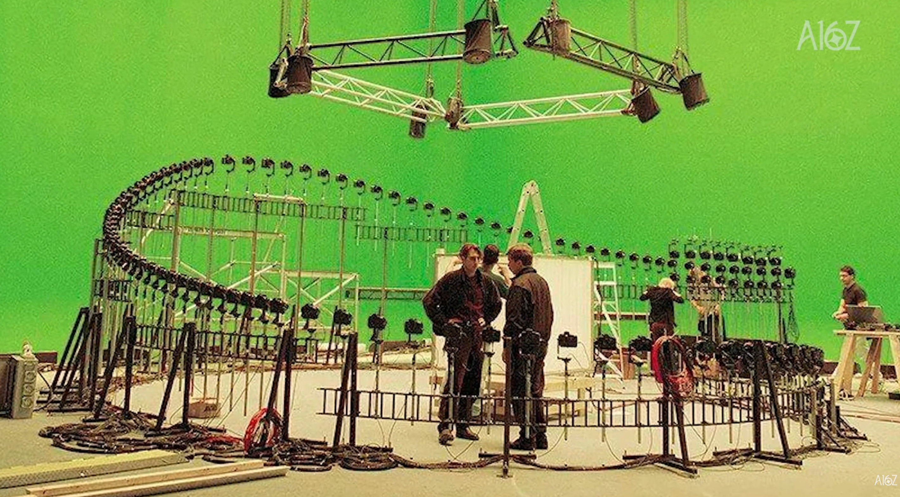
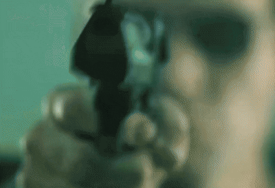

> **[图 1]** 《黑客帝国》子弹时刻的拍摄现场。注意那条 S 形轨道上密密麻麻的相机，以及中间站着的人——那就是尺度。

2026 年 9 月 1 日，World Labs 发布了新一代世界模型 Atlas。它的演示里有一个几乎一模一样的镜头：一滴牛奶砸进碗里，溅起的皇冠在半空中被冻住，视角绕着它飞过去。

拍这个镜头的现场是这样的：

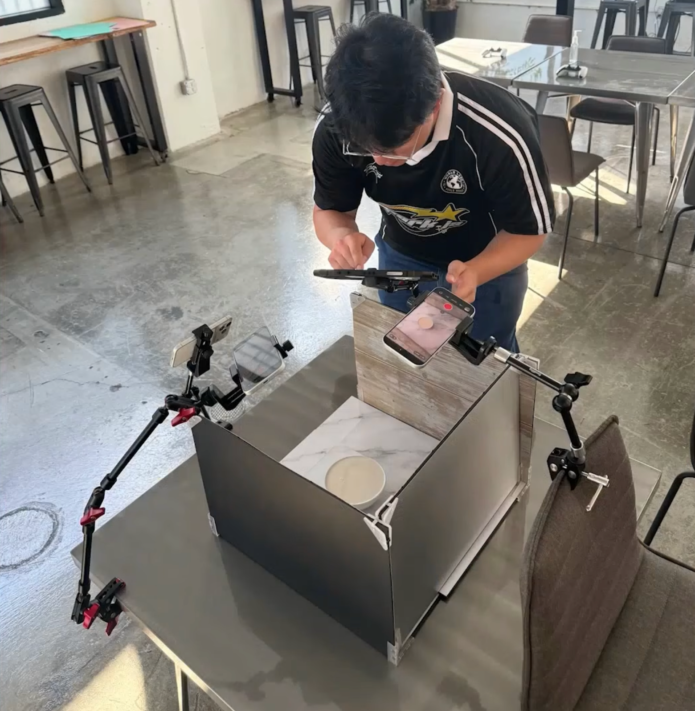
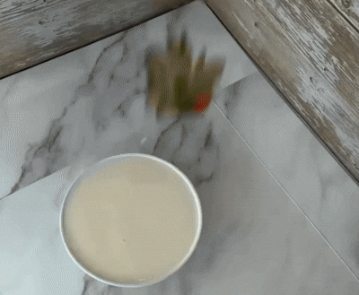

> **[图 2]** 一张桌子、一个灯箱、三部手机夹在魔术臂上。

27 年，从一个房间到一张桌子。但真正值得讲的不是这个对比，而是**中间那一百多台相机去哪了**。它们没有消失，是被吸收进模型里变成了一种能力——而 World Labs 认为，这个能力就是整个"空间智能"的地基。

## 一、什么叫 "AI complete"

那是一种什么能力？

说穿了只有一个字：**补**。没有相机去过的角度，模型把它补出来。

这听起来平平无奇——"补"这种事，手机输入法天天在做。但这一节要讲的正是：**一件足够难的"补"，会逼出真正的理解。**这不是修辞，这是大语言模型已经走通过一遍的那条路，也是 World Labs 押注的全部依据。

而要讲清楚这条路，得先绕回一个更老的问题：**我们凭什么说一台机器"懂"了？**

最早的答案是图灵给的。

1950 年，图灵在《计算机器与智能》里提出了一个他自己称为"模仿游戏"的测试：让一位人类判官隔着文字，同时跟一个人和一台机器对话；如果判官分不出哪边是机器，那这台机器就算**通过了图灵测试**。（顺带澄清一个常见的混淆：这跟"图灵机"是两码事。图灵机是图灵 1936 年提出的抽象计算模型，两个概念只是碰巧共用了他的名字。）

图灵测试给的是一个**判定标准**：分不出来就算数。

后来 AI 领域还发展出另一套说法，叫 **AI-complete**。这个词是仿照计算机科学里的 NP-complete 造出来的，意思很硬：**如果解决了一个问题就等于造出了通用智能，那这个问题就是 AI-complete 的。** 它说的不是"这题有点难"，而是"这题难到跟整个 AI 问题本身等价"。有意思的是，有人从形式上论证过：图灵测试本身就是一个 AI-complete 问题。

但判定标准也好，问题分类也好，都不是**考法**——总不能真把每个模型拉去跟人聊天让判官投票。

真正好用的考法，就是开头那个字：**补**。

### Ilya 的那本侦探小说

Ilya Sutskever 讲过一个思想实验：

假设你刚读完一整本侦探小说。几百页的线索、误导、复杂的人物关系。最后一页，侦探把所有人召集到客厅，说："**凶手的名字是——**"

现在，请你预测下一个词。

要答对这个名字，你不能靠猜。你必须追踪过每个嫌疑人的不在场证明，识别出哪些线索是故意的误导，理解每个人的动机，并且把整本书的叙事同时端在脑子里。

> **[图 3]** 普通的自动补全在"接词"——依赖局部搭配，续写出"听起来像对的"内容。强大的 LLM 是在**解谜**。

这就是关键的一步转折：**补全，只要要求足够高，就不再是补全，而是理解。**

输入法补出"就这样吧"靠的是短距离搭配；而要补对"凶手的名字"，模型必须在内部维持一个自洽的世界——谁在哪、谁撒了谎、哪条线索是假的。**预测这件事本身没有智能含量，是"预测得足够准"这个要求逼出了智能。**

这就是为什么"猜下一个词"这道看起来无比枯燥的题，能一路长成今天的大语言模型。

### 世界模型的那本侦探电影

李飞飞的 World Labs 押的注，是同一道题换个考场。

把一整部侦探电影放进模型的上下文窗口：人物关系、动机、关键线索、不在场证明、误导信息、时间线、走廊尽头那扇神秘的门。然后你给它下一个指令——

**"生成凶手从门后走出的那个镜头。"**

> **[图 4]** 要生成这一个镜头，模型必须回答：谁最可疑？哪些线索是误导？门后应该站着谁？这一镜在叙事上是否成立？

这道题跟侦探小说那道题是**同一道**。要生成对，模型不能只是把前一帧的像素往后推一点。它得知道门后面是个多大的空间、光从哪来、那个人有多高、他站在什么位置、门朝哪边开——**它不是在补全像素，它是在补全世界的状态。**

用 World Labs 联合创始人 Justin Johnson 的原话来定位这件事：LLM 建立在 next token prediction 上，视频模型建立在 next frame prediction 上，而 Atlas 建立在 **new view prediction** 上。

这里有个翻译上的坑，必须先说准。

**new，不是 next。** 它不是"顺着时间往下推的那一帧"，而是"**你随便指定的任意一个位置**"——一个从来没有任何相机去过的位置。是**用户**在调度机位，不是模型顺着惯性往下滑。

而模型交出的那张画面，必须同时在**空间和时间上都对得上账**：绕到侧面，桌子还是那张桌子，杯子还在原位；而且这一眼看到的时刻，跟别的机位看到的是同一个时刻。空间三维加时间一维，业内叫 4D 自洽。

所以这道题的中文，本文统一叫**视角补全**：你指定一个从没被拍到过的机位，模型补出那一眼——而且这一眼要跟整个空间、整段时间都不打架。

一句话对齐三代模型的考法：

| | 你给什么 | 模型补什么 | 补对了说明它懂什么 |
|---|---|---|---|
| **LLM** | 一整本侦探小说 | 下一个词 | 懂这个**故事** |
| **视频模型** | 一段画面 | 下一帧 | 懂画面的**惯性** |
| **世界模型** | 若干张照片 + 一个你指定的机位 | 那个机位上的一眼 | 懂这个**空间** |

## 二、空间被写进了架构里

上一节讲的是 Atlas 换了哪道考题。这一节讲它怎么把那道题做进架构里。

答案可以先说：**它给"空间"在模型内部留了一个位置。**

为此，官方明说要另起炉灶——而要脱离的对象，正是上一节表格里那两行：

> 这些目标要求我们脱离 LLM 和视频模型所用的标准架构，设计一个新的基础架构，作为未来世界模型的地基。

### 拆开那个吓人的名字

Atlas 的官方全称是一串唬人的词：**多模态自回归扩散 Transformer**。但它其实只是四个形容词，World Labs 自己把它们一个一个拆开讲了：

- **多模态**——它原生处理文字、图像、**相机位姿**、三维深度图（视频就是图像序列）。关键在第三项：**每一张图像和每一张深度图，都绑定一个明确的相机位姿**——位姿就是相机在空间里的位置和朝向，也就是"站在哪儿、朝哪边看"。官方的说法是，这让"空间控制成为架构的核心组成部分"。
- **自回归**——一切都是序列，一次生成一个元素，每个新元素都以前面的内容为条件。好处是：**每个任务只是一种不同的序列，输入在前，输出在后**。重建、生成、仿真在它眼里不是三件事，是三种排列方式。
- **扩散**——用逐步去噪的方式生成，擅长图像视频这类高维连续数据，还能靠调节去噪步数，在速度和质量之间换。
- **Transformer**——主要是大规模矩阵乘法，跟现代硬件契合，是个结实的骨架。

四条合起来，官方给了一个说法：它们使**一种基于"空间上下文"（spatial context）的新生成范式**成为可能。

这个词是这一节的全部重点。

### 每一张图底下都挂着一个相机

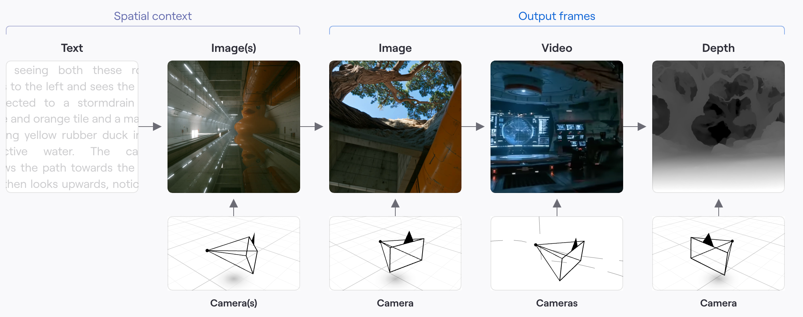

> **[图 5]** Atlas 的架构示意。左边一组是输入（spatial context），右边一组是输出（图像、视频、深度）。**看最下面那一排**：每一张图像——不管是喂进去的还是生成出来的——底下都挂着一个相机，那是它在三维空间里的位置和朝向。

上面那些画面可以先不管，只看最下面一排：每一格底下都画着一个三维网格和一个相机锥体。

意思是，对 Atlas 来说，"一张图"从来不是一张孤立的图片，而是"**从空间中这个位置、这个朝向看出去的一眼**"。官方原话是：**每张图像都被固定在空间中的一个三维位置上，这就构成了空间上下文。**

对照一下就知道这一步有多要紧。视频模型的输入是"一段像素"，空间得从像素里去猜；而 Atlas 的输入是"**位置 + 从那个位置看到的画面**"——空间不用猜，它本来就写在输入里。

这也解释了图上右边为什么能同时长出图像、视频、深度三种输出，而且每一种都各自挂着相机：它们不是三个模型，是同一个序列的三种续法。

### 两代模型，两种地基

World Labs 上一代的世界模型叫 **Marble**。它的地基是一种叫**高斯泼溅**（Gaussian splats）的格式——可以粗略理解成把一个三维场景存成几百万个带颜色的小光斑，远看就成了一个场景。

两代摆在一起，区别就清楚了：

- **Marble 的地基是一种格式**：所有东西都得先塞进小光斑，再从小光斑里出来。
- **Atlas 的地基是一道题**：任意给一个机位，说出你会看到什么。

这里要澄清一个容易传错的说法：**Atlas 并没有抛弃小光斑。**

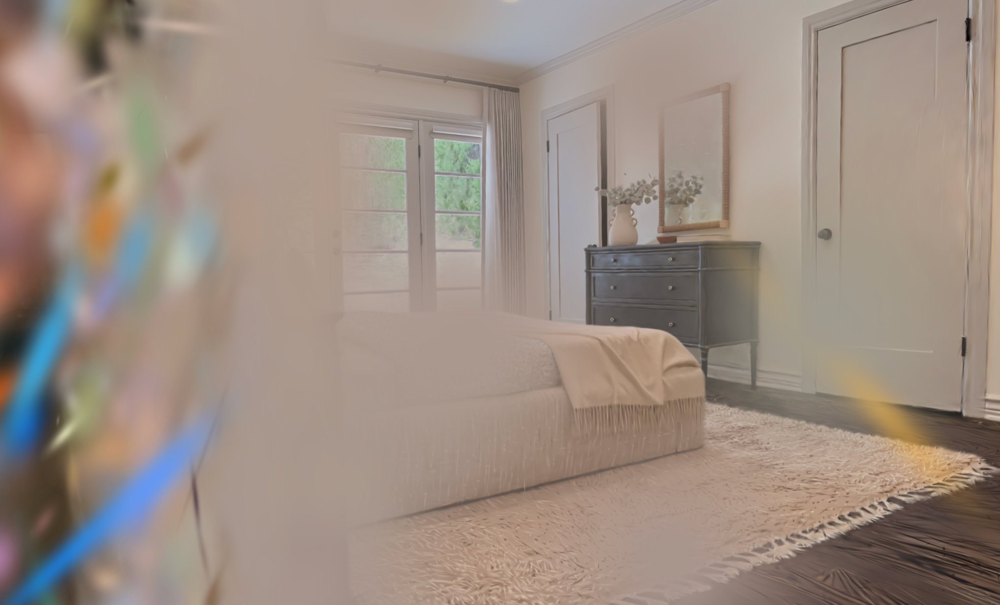

> **[图 6]** Atlas 输出的一个高斯泼溅场景，**特意挑了一个刁钻的角度**。画面左右两侧那些拉长的、泛着彩虹色的斑块，就是"小光斑"本身——正面看它们叠在一起就是一个正常房间，转到边缘才露出马脚。

官方对这一步的描述是：**点云只是估计出场景的几何，而高斯泼溅让它变得可用**。Atlas 把点云上剩下的窟窿补掉，变成一个完整的小光斑场景，可以直接在设备上以高分辨率、高帧率实时渲染。而这"和 Marble 用的是同一种表示"。

这句话把小光斑的位置说得很清楚了：它是**最后一步的交付格式**——为了能实时转着看——而不是模型思考问题的方式。所以变的不是输出格式，是**地基**：小光斑从"必经之路"降级成了"输出选项之一"。

这个区别决定了天花板在哪。当地基是一种格式时，模型的能力上限就是那个格式的表达力上限；当地基变成"任意给一个机位，说出你会看到什么"时，格式只是最后一步的打包方式，随时可以换。

而当空间在架构里有了自己的位置之后，一件长期被认为必须分开做的事，忽然可以合并了。

## 三、两种病，一副药

Atlas 真正让人觉得"这一步走对了"的地方，是它同时治好了两个一直被分开对待的毛病。过去做三维，有两条互不搭界的技术路线：

**生成（generation）**，凭想象画。今天绝大多数视频生成模型走的是**扩散**这条路：训练时把一段干净视频反复加噪声，直到糊成一团雪花，再让模型学着一步步把噪声擦回去；生成时反过来——给它一团随机噪声加一句提示词，让它一层层擦，擦出一段画面。

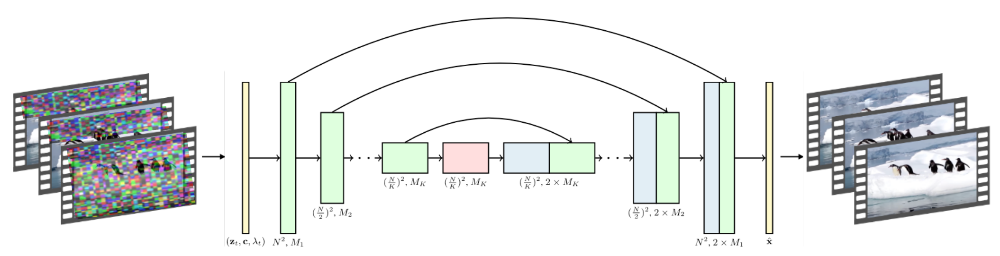

> **[图 7]** 一个典型视频扩散模型的完整流程，左边进去的是噪声，右边出来的是画面。**你不需要看懂图里任何一个符号，只要注意一件事：从左到右，没有任何一个环节代表"空间"。**

这就是它的病根。模型从头到尾操作的都是像素，"那把椅子在三维空间的哪个位置、离镜头多远"这件事，在这条流水线里根本没有落脚的地方。所以它画得出很好看的画面，但你换个角度再问一次，它是**重新编一遍**——没有任何机制保证两次编的是同一个世界。你从左边看，它补一把椅子；绕到右边再看，椅子换了个样，或者干脆不见了。画面永远是满的，没有窟窿，但前后不对账。

**重建（reconstruction）**，照着拍到的东西还原。传统做法是先从照片里恢复出场景的几何，再用光线追踪一类的方法算出换个机位该看到什么。忠实，拍到什么是什么；但**没拍到的地方就是窟窿**。

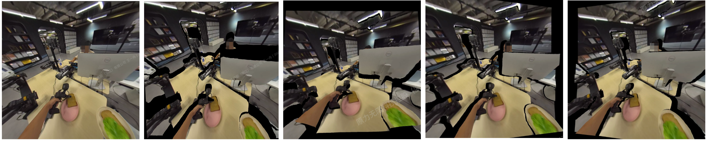

> **[图 8]** 左 1 是原图。右边四张，是把相机位置分别向上、下、左、右各挪 **20 厘米**之后合成出的新视角。那些黑色区域就是空洞——原图那个角度根本没观测到的空间点。注意，只挪了 20 厘米。

被前景挡住的桌面、物体的侧面和背面、画面边缘之外——原图没看见的，重建就补不出来。它不会骗你，但它也不会替你想。

一边是"敢画但不可信"，一边是"可信但画不满"。行业长期的做法是各用各的，或者硬拼在一起。

Atlas 的做法是：**用同一个模型，一次算完，同时给出两样东西**——你指定的那个机位上应该看到的画面（RGB），以及画面里每一个点离你有多远（深度）。看到过的区域它做重建，没看到过的区域它做生成，**而这两件事是在同一次计算里完成的，依据的是同一样东西——就是上一节那个"空间上下文"**：每一张图都被钉在三维空间的一个位置上。所以补出来的东西，天然和拍到的东西对得上账。

这就是为什么它不脑补出矛盾：不是它编得更收敛，而是它编的时候，脑子里那个空间是同一个。

这话还是抽象。看一个例子。

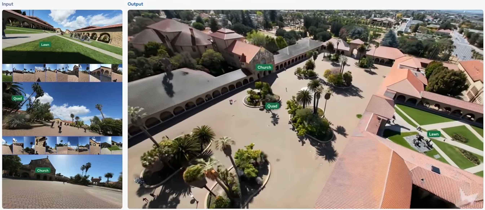

> **[图 9]** 左边是**全部输入**：25 张斯坦福校园的照片，**每一张都是人站在地面上举着相机拍的——没有一张来自无人机，没有一张来自空中**。右边是输出：一张空中鸟瞰。左右两边都标了 Lawn、Quad、Church 三个地标，可以自己对一遍。

把 [图 9] 和 [图 8] 摆在一起，这一节就讲完了。

传统方法把机位挪 **20 厘米**，画面上就已经是一片黑洞。而这里的机位变化是**从地面升到天上**——一个在原始素材里彻底不存在的视角。按理说这应该是满屏空洞才对：屋顶没人拍过，树冠的上表面没人拍过，楼与楼之间的空隙没人拍过。

但输出是满的。而且不只是满的——图上那三个地标标签，就是让你自己去验的：

- **几何是准的。** Lawn、Quad、Church 在地面照片里只是三张互不相干的画面；到了鸟瞰图上，它们各自落在正确的位置，朝向、间距、连接它们的道路走向都对得起来。模型不是把三张照片拼贴在一起，是**把它们放进了同一个校园**。
- **像素是准的。** 不是糊成一团印象派的"看起来像个大学"——教堂的拱廊、屋顶的瓦、广场上那几丛棕榈，都能一眼认出是哪儿。

这是纯重建做不到的，因为它没有权限去补没拍到的地方——它只会给你一片黑。这也是纯生成做不到的：让一个视频扩散模型画一张校园鸟瞰图，它能画得很好看，但那会是一个**虚构的**校园，楼的位置是编的，跟你手里那 25 张地面照片对不上。

屋顶那部分是补出来的，地面那部分是重建出来的——但它们不是两道工序，而是**同一次视角补全**的两半。你指定了一个天上的机位，模型把那一眼交出来；至于这一眼里哪些像素来自观测、哪些来自推断，**那是我们的分类，不是它的**。

### 会脑补的，反而更准

看到这里有一个合理的怀疑：一个天天在编东西的模型，凭什么在"准"这件事上被信任？把重建交给它，听起来像是拿精度换观感。

数字给的答案是反过来的。

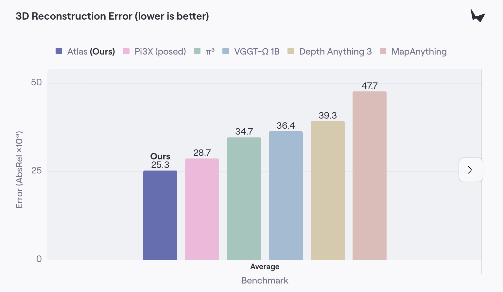

> **[图 10]** 三维重建误差，**越低越好**。Atlas 25.3，其后依次是 Pi3X 28.7、π³ 34.7、VGGT-Ω 1B 36.4、Depth Anything 3 39.3、MapAnything 47.7。（World Labs 公布的数据。）

后面那五个对手，全是**专门做重建和深度估计**的模型——它们不生成、不脑补，只干"照着拍到的东西还原"这一件事。而 Atlas 这个会脑补的生成式模型，在它们的主场上赢了它们。

这件事值得停一下：**补全不是精度的敌人，反而是精度的来源。**一个只会照搬的模型，遇到遮挡、反光、纹理太平的地方就只能瞎猜；而一个真正理解了这个空间的模型，哪怕那块拍得不好，它也知道那儿本该是什么。

这正是 Ilya 那个思想实验的结论，在数字上的回声——**"预测得足够准"这个要求本身，会逼出理解。**

开头那碗牛奶，是同一件事的小号版本：3 部手机，镜头绕飞时经过的绝大部分角度根本没被拍到过，而绕完一圈，那顶皇冠还是同一顶皇冠。《黑客帝国》当年要架 120 台相机，本质上是因为**当时没有模型，每一个角度都必须真的去拍**——绿幕棚里那条相机弧线，就是"未观测区域"的物理解法：用钱和硬件，把所有角度买下来。

现在那一百多台相机，被折叠进了模型的先验里。这不是省钱的问题，是**能力的位置变了**：过去靠采集，现在靠理解。

## 四、这条路的终点是机器人

如果只把 Atlas 看成一个影视和内容工具，会低估它。

### 想进具身，态度很明确

2026 年 7 月 21 日，World Labs 收购了一家叫 **SceniX** 的公司——**这是 World Labs 成立以来的第一笔收购**。SceniX 2024 年成立于纽约，被收购前只有个位数员工，三位联合创始人是 Yunzhu Li、Changxi Zheng 和 Xiaochen Hu。金额没有披露。

六周之后 Atlas 发布，而 World Labs 在它的能力清单里明确列了一项：**机器人仿真 / Real-to-Sim**。再往前看，2026 年 2 月 18 日 World Labs 刚宣布了一轮 **10 亿美元**融资，投资方里有 AMD、NVIDIA、Autodesk、Emerson Collective、Fidelity 和 Sea——注意前三家的身份，它们不是财务投资人，是这条路上的产业方。

一家不缺钱的公司，把成立以来的第一笔收购花在机器人仿真上，六周后发布的旗舰模型把机器人仿真写进主打能力。这个信号不需要解读。

### SceniX 带来的是什么

SceniX 的自我描述是"用混合仿真造通用机器人"。它的核心技术 World Labs 现在叫 **R2S2R**（Real-to-Sim-to-Real），大白话就是"**搬进来，练，再拿回去**"：

- **搬进来**：把真实的机器人、传感器、环境、物体，连同它们之间的**交互**，一起搬进仿真；
- **练，再拿回去**：在这些仿真世界里训练和评测策略，然后判断——**它在仿真里的表现，能不能预测它在真机上的表现**。

关键在**倍数**：一个真实任务，变成上千个可控的仿真世界。物体摆放、机器人状态、观察视角、外观、物理参数、速度、难度，全都可以调。真机上做一次的成本，在仿真里可以做一千次。

机器人行业最贵的东西是真实数据——每一次抓取、每一次失败，都要占用一台真机、一个场地、一段时间。R2S2R 就是冲着这个成本结构去的。

两位创始人的背景解释了为什么是这家公司。**Yunzhu Li** 是哥伦比亚大学助理教授，MIT 博士，之后在斯坦福做博士后——**跟的正是李飞飞**。**Changxi Zheng** 也是哥大教授，长期做物理仿真、数值仿真和可形变物体。一个管机器人学习，一个管高保真物理，合起来正好是 R2S2R 这道题。这不是一笔随机的收购。

### 他们报出来的结果

收购一周后，World Labs 放出了技术结果，核心是三条：

- 任务在仿真里重建之后，策略**完全在仿真里训练，零真实训练数据**，然后直接迁移到实体机器人上；
- 有四项任务在真机上**连续自主运行一小时，全程无人干预**；
- 仿真里的评测**能够预测**哪个策略在现实里更好——这意味着可以在仿真里搜索失败区域，而不必在硬件上把每一种失败都撞一遍。

更值得注意的是他们挑的任务：弹性线缆插孔、纸箱折叠封装、试管转移、从密集杂物里挑出细长物体。这些**全是传统仿真器最不擅长的**——不是刚体的抓取放置，而是会变形、会持续接触、公差极小的东西。要仿真这些，光对上外观和几何还不够，还得对上摩擦、质量、形变、接触，以及机器人本身的标定。

（需要说明：这些是 World Labs 自己公布的结果，不是第三方基准测试。）

## 五、画得像，还是摆得对

这里要回到 [图 9] 那张斯坦福鸟瞰图。

2026 年 6 月，也就是收购之前，李飞飞发过一篇《世界模型的功能分类》，把世界模型按功能分成三种：

- **渲染器（renderer）**：预测世界**看起来**是什么样；
- **仿真器（simulator）**：预测世界在**动作发生之后**会怎么变；
- **规划器（planner）**：预测**该采取什么动作**。

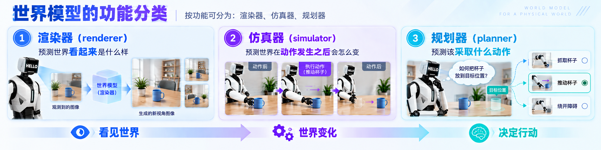

> **[图 11]** 三种功能顺次递进：**看见世界 → 世界变化 → 决定行动**。渲染器只回答"看起来是什么样"，仿真器回答"推了这个杯子之后会怎样"，规划器回答"该推还是该绕开"。

她在文章里明说，**仿真器是那个枢纽**（linchpin）——因为只有它能把一个"世界"变成"智能体可以在里面行动、学习、被评测的地方"。她还给了一个很锋利的区分：**渲染器的契约是视觉上的，仿真器的契约是结构上的。**

今天绝大多数所谓的世界模型，停在渲染器这一层。它们能生成非常好看的画面，但那份契约只到"看起来对"为止。

机器人要的是后一种契约。它不需要画面好看，它需要**那个杯子的位置是对的**。差两厘米，手就抓空了。

这才是 [图 9] 里"几何是准的"那句话真正的分量。当时它看起来像个画质指标——鸟瞰图里楼的位置对得上。但到了机器人这里，它是**分水岭**：几何不准的世界模型，画面再漂亮也只能当渲染器用；几何准的世界模型，才有资格当仿真器。

Atlas 输出的也不只是画面，还有**深度**。这个东西对做视频的人几乎没用，但对机器人是刚需——机器人不需要一张漂亮的图，它需要知道那个杯子离手有多远。Atlas 输出的是机器人传感器会读到的东西，不是给人眼看的东西。

路线图因此很清楚：Atlas 负责把真实世界**搬进来并且几何精准地补全**，SceniX 负责让搬进来的世界**能被动手**——物理对齐、交互仿真、策略训练与评测，再拿回真机。中间那道 sim-to-real gap，用一个真正理解空间的模型去填。

### 已经跑通的，和还没跑通的

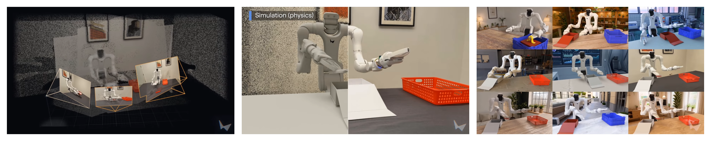

> **[图 12]** 从左到右：把真实房间和机器人采集进来（白色线框是拍摄时的机位）；在里面跑物理仿真；然后把同一个任务批量换环境、换光照、换器具，渲染成大量变体。

**造世界这半边，是跑通了的。**采集 → 补出没拍到的视角 → 物理仿真 → 渲染成千上万个变体，这条链路已经能完整演示。而这恰好是 Atlas 最擅长的那一段——它做的就是"从稀疏的观测里补出一个几何精准的世界"，接进来是顺理成章的事。

**但造出世界，不等于造出会干活的机器人。**

前面那批一小时无人干预的结果，是**一个任务一个策略**：装箱的策略只会装箱，插线的策略只会插线。而一个真正能用的机器人，还需要几样目前**完全没有公开展示**的能力：

- **通用的操作能力**——不是每换一个任务就重训一个策略，而是跨任务都能上手；
- **听懂指令**——人说"把桌上那个红盒子放进筐里"，它得知道指的是哪个；
- **推理**——遇到没见过的摆放和障碍，能想出办法，而不是重复地失败；
- **记忆与进度追踪**——记得自己做到第几步了，别把已经封好的箱子再拆一遍。

这些才是具身智能真正难的部分，而它们和"把世界搬进电脑"是两类问题。

换个说法：World Labs 现在造出来的是**训练场**，不是**运动员**。训练场很关键——没有它，运动员没地方练；但有了训练场，不等于运动员就会出现。

接下来值得盯的正是这件事：World Labs 和它新的具身团队，能不能在这个训练场上，真的养出一个运动员。

### 补全的第三级

回到全文那个"补"字。

- LLM 补的是**下一个词**，补对了说明它懂这个**故事**；
- Atlas 补的是**你指定的那一眼**，补对了说明它懂这个**空间**；
- 而机器人要的，是补**一个动作的后果**——我伸手推这个杯子，接下来会发生什么。

前两级回答的是"世界是什么样"，第三级回答的是"世界会怎么变"。World Labs 买 SceniX，买的就是从第二级迈向第三级的那一步。而"视角补全"这道题本身对机器人也是现成的：机器人就是一台不断在换机位的相机，每走一步、每转一次头，都在提出一个新的视角请求。

World Labs 在收购公告里那句话说得很干脆：**"Robotics is where spatial intelligence becomes physical."**（机器人是空间智能变成物理现实的地方。）

## 结尾：一个赌注，还没到兑现的时候

Atlas 目前是早期访问，能生成 1440p、最长 1 分钟的视频，动态能力还很弱。它不是一个"已经赢了"的模型。

但它把赌注押得很明确了：**空间智能也是 AI-complete 的，而检验它的那道补全题，叫视角补全。**

"猜下一个词"这道题的历史我们都看过——它一开始只被当成一个补全工具，被认为学不到真东西，直到规模上去之后把整个语言领域一口气吞了。World Labs 赌的是同一个形状的故事：如果视角补全足够通用，那么把它做到极致，重建、生成、仿真、乃至机器人的物理常识，都会作为副产品掉出来。

这个赌注可能不成立。也许空间的规律没那么容易被一道补全题榨出来，也许动态和物理需要完全不同的地基。

而三级补全，眼下只兑现了两级：补一个词，已经把整个语言领域吞掉了；补一眼，Atlas 刚刚证明它做得到；至于补一个动作的后果——那个能在现实里真的把活干成的机器人——训练场刚搭好，运动员还没上场。

但至少现在，一件 27 年前需要一整个绿幕棚才能做到的事，被一张桌子上的三部手机做成了。而做成它的方式，不是造了更好的相机。

---

### 资料来源

- Atlas 官方发布：[Atlas: A World Model for Spatial Intelligence — World Labs](https://www.worldlabs.ai/blog/atlas)
- 图 1、图 2 截自 World Labs 与 a16z 的访谈（Martin Casado 对谈 World Labs 创始团队）：[Why World Models Could Change Robotics, 3D, and Creativity](https://www.youtube.com/watch?v=qn1QDDBnTA0)
- SceniX 收购公告：[World Labs Acquires SceniX](https://www.worldlabs.ai/blog/scenix)
- R2S2R 技术结果：[Building Worlds That Train Robots — World Labs](https://www.worldlabs.ai/blog/real-to-sim-to-real)
- 渲染器/仿真器/规划器的三分法与"仿真器是枢纽"：[A Functional Taxonomy of World Models — Fei-Fei Li / World Labs，2026 年 6 月 3 日](https://www.worldlabs.ai/blog/taxonomy-of-world-models)
- 10 亿美元融资公告：[World Labs Announces New Funding，2026 年 2 月 18 日](https://www.worldlabs.ai/blog/funding-2026)
- "new view prediction" 的定位与 Justin Johnson 表述：[World Labs Atlas bets on new view prediction — StartupHub.ai](https://www.startuphub.ai/ai-news/ai-research/2026/world-labs-atlas-bets-on-new-view-prediction)
- 发布报道：[Fei-Fei Li's World Labs debuts Atlas — SiliconANGLE](https://siliconangle.com/2026/09/01/fei-fei-lis-world-labs-debuts-atlas-a-world-model-showcase-for-advanced-spatial-intelligence/)
- SceniX 背景：[Fei-Fei Li's World Labs buys SceniX to push into robotics — Dealroom](https://dealroom.co/news/140205-fei-fei-lis-world-labs-buys-scenix-to-push-into-robotics/)
- Ilya Sutskever 的侦探小说思想实验（2023 年 GTC 与黄仁勋对谈）：[Ilya Sutskever Explains How LLMs Being Able To Predict The Next Word Shows Real Understanding — OfficeChai](https://officechai.com/stories/ilya-sutskever-explains-how-llms-being-able-to-predict-the-next-word-shows-real-understanding/)
- AI-complete 的定义与它同图灵测试的关系：[AI-complete — Wikipedia](https://en.wikipedia.org/wiki/AI-complete)
- 《黑客帝国》子弹时刻拍摄用机数量：['The Matrix' Needed 120 Cameras — Cheat Sheet](https://www.cheatsheet.com/entertainment/the-matrix-needed-120-cameras-to-film-movies-iconic-bullet-time-scenes.html/)
