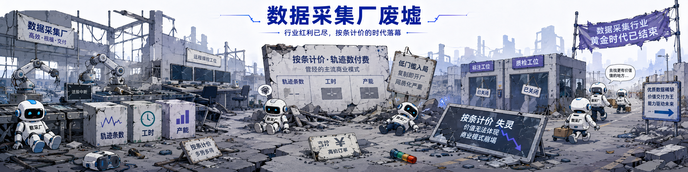
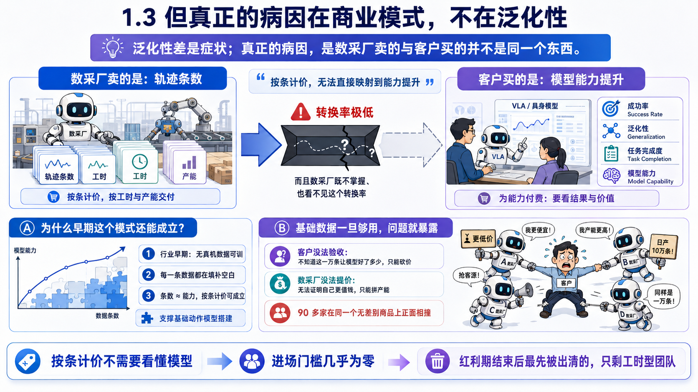
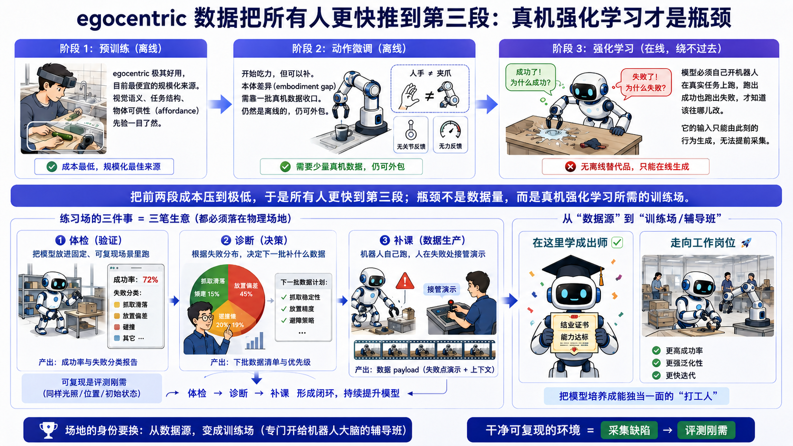
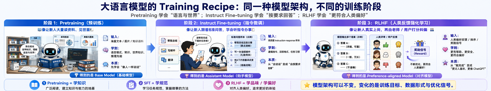
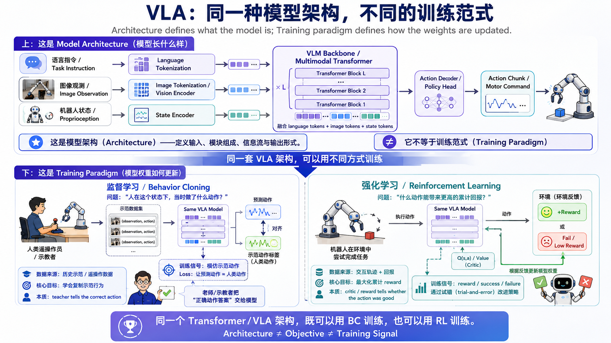
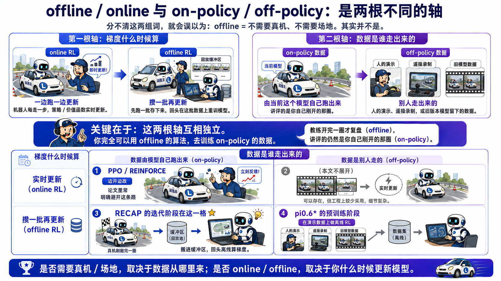
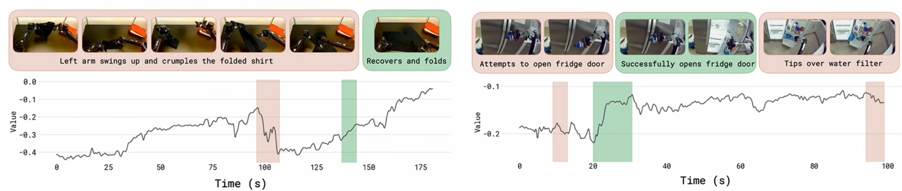
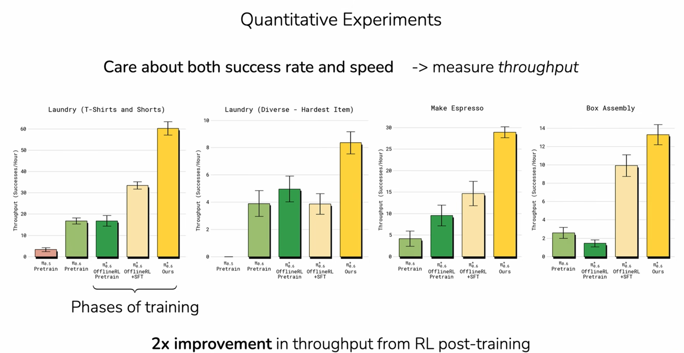
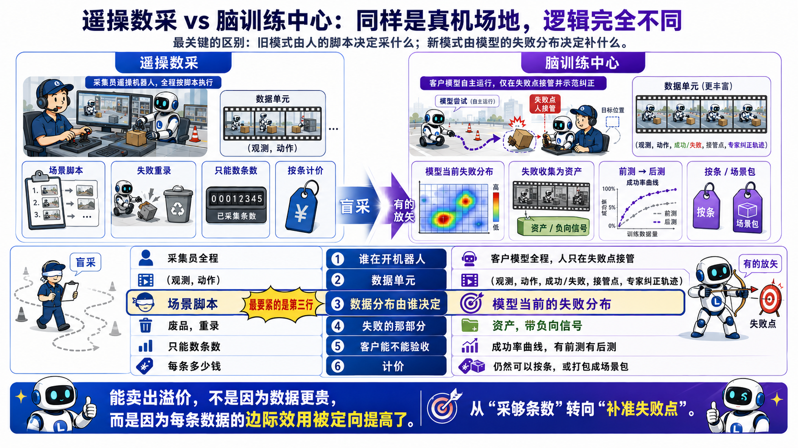

## 0. 一场争论，和一场主动的撤退

### 0.1 有人把话说破了

2026 年 9 月初，一位刚带着公司完成上市的机器人行业创始人，在朋友圈里把话说得很重，并且点了名。

据媒体转述，他的核心意思是：二级市场不是风险投资市场，一家公司走到上市这一步，至少要先证明自己有真实、可持续、有一定规模的业务，以及与之匹配的治理水平。而具身智能赛道里有一批公司不是这样——它们靠"攒局"起家，用**建数采场、做关联交易**这类办法把收入做出来，再借地方政府和国资的投资推着自己快速上市。

被点名的一方第二天发了声明，大意是不参与无谓的口水战，公司的壁垒建立在真实的研发投入和已经跑了两年的落地场景上。

谁更占理，本文不做裁判。这场争论真正的价值，在于它把一件行业里人人心里有数、但很少摆到台面上的事，第一次摊开在了公众面前。

### 0.2 那个被点名的闭环

把它拆开，是这样一圈：

> **机器人厂商把本体卖给数采场 → 数采场用这些机器人采数据 → 厂商本身、或者它关联的数据服务公司，再把这批数据回购回来。**

钱从厂商账上出去，绕一圈变成厂商账上的收入；机器人完成了出货，数据找到了买家，场子拿到了订单——三方的报表同时变好看。地方乐见其成，因为落地了一个看得见的产业项目；国资跟着投进来，因为投的是一个有营收、有订单的标的。

整条链条上唯一没出现过的角色，是**一个因为"这批数据真的让我的模型变好了"而自愿掏钱的客户**。

这不是个别现象。IDC 的统计是，2025 年人形机器人的出货量里，商演、科研和数采场景合计占 **78.4%**；真正进到生产环节干活的，不到四分之一。

所以那位创始人真正骂的不是采数据这件事，是**数据回购**这个动作：有它兜着，一个场子的全部经营指标都可以是安排出来的，而不是挣出来的。收入多少、交付了多少条、机器人上了多少台，在回购条款面前都不构成证据——因为这些数字是先约好的。

于是绕不开这么一问：

> **把回购这层兜底拿掉，数采场这门生意，还剩下什么？**

这个问题有一个不靠谁表态的答案。它发生在这场争论之前十天。

### 0.3 一场主动的撤退

2026 年 8 月 28 日，多家媒体报道，北京首个人形机器人数据训练中心已停止运营。

这个中心 2025 年 3 月在石景山首钢园揭牌，占地约 3000 平方米，部署过 100 多台机器人，搭了家庭康养、特种作业、新零售、汽车装配、机器人新餐饮、3C 电子工厂等十大实景场景，年产出超百万条多模态数据。石景山区方面当初的预期是：年数据交易超 100 万条，三年内形成 50 亿元规模的机器人数据服务市场。

核心设备与技术的提供方睿尔曼智能已经撤出。这家公司成立于 2018 年，主营关节模组、机械臂和轮式机器人，2026 年 3 月完成近 5 亿元 C 轮融资，8 月启动创业板上市辅导——不是一家撑不下去的公司，是一家主动掉头的公司。

这一点决定了这件事该怎么读：**倒下的不是一家数采场，是一种数采模式。**

问题是，同样的模式，全国还有一百多家在跑。

而这一百多家是靠什么跑起来的——是客户真金白银买数据，还是 0.2 那个闭环在供血——正是那场争论在吵的东西。本文不替任何一方辩护，只想回答一个更难的问题：**如果供血停了，这一百多家里，还有没有一种活法。**

---

## 1. 红海：按条计价的生意为什么撑不住

先把 0.2 那个闭环放到一边。假设需求全是真的——客户真金白银来买数据，没有任何回购兜底——这门生意**依然**撑不住。

这一节讲的就是这个：不是钱脏，是模式本身有天花板。两个问题得分开看，否则容易得出"把关联交易清理掉就没事了"的结论。

### 1.1 标准模式

过去两年，国内数采场的模式高度一致：租一块场地，搭若干个实景场景，批量采购不同厂商的机器人本体，招一批采集员，用遥操作（操作员通过手柄、动捕或主从臂驱动机器人）录制动作，**按轨迹条数/有效数据时长向模型公司结算**。

这个模式跑得很快。据中国信通院等机构 2026 年 8 月发布的《具身智能训练场研究报告（2026 年）》，全国已建成的具身智能数采 / 训练场超过 70 家，另有 46 家在建及规划中，**总布局超过 110 家**。

### 1.2 睿尔曼自己的复盘

睿尔曼给出的撤出理由，公开可查的有三条：

**一是环境太干净。** 该公司相关负责人对南都记者表示，实验室遥操采集是在封闭的标准化场景中完成动作录制，环境参数可控、光照固定、场景相对单一，产出的数据无法覆盖真实世界中光线干扰、物料偏差、场地不平、工况异常等不可预知的物理变量，导致机器人的环境泛化能力一般。

**二是重资产纯投入。** 场地建设、专用设备、专职数采团队都要单独投，所有成本都是纯研发投入，没有业务收入摊薄。

**三是单位有效数据成本高。** 这是前两条的乘积——由于数据泛化性有限，大量采集的数据无法落地应用，折算到"可落地的有效数据"上，单条成本很高。

睿尔曼董秘把石景山定义为公司数据采集的 1.0 版本：完成了从 0 到 1 的验证，积累了千万级轨迹片段数据，但本质上仍是"实验室场景"。用该公司的话说，实验室遥操数采解决"有没有数据"的问题，到真实作业环境中远程遥操数采，解决的是"数据好不好"的问题。

### 1.3 但真正的病因在商业模式，不在泛化性

泛化性差是症状。病因是一句更简单的话：

> **数采场卖的是"轨迹条数"，客户买的是"模型能力提升"。这两者之间的转换率极低，而且数采场既不掌握、也看不见这个转换率。**

这个错配在早期是被掩盖的。当行业整体处在"无真机数据可训"的阶段，条数和能力近似成正比——任何一条数据都在填一片空白，所以按条计价是成立的、公平的、可结算的。睿尔曼说石景山"解决了具身智能无真机数据可训的早期空白问题，支撑了基础动作模型的搭建"，这句话是真的。

但基础数据一旦够用，这条正比关系就断了。断了之后，问题变成：

- 客户没法验收。他不知道这一万条让模型好了多少，只能砍价。
- 数采场没法提价。它无法证明自己这一万条比隔壁那一万条更值钱，只能拼产能。
- 七十多家已经建成的场子在同一个无差别计量商品上正面相撞，后面还排着四十多家。

还有一个后果值得单独说：**按条计价不需要看懂模型。**

所以进场门槛几乎为零。一个不懂具身智能的运营团队，只要能租到场地、买到机器人、招到人，就能开工计件。这批团队在数据红利期是产能，在红利期结束后是最先出清的一批——因为他们手里除了工时，没有任何别的东西。

这一点先记在这儿，第 4 节要用。

---

## 2. 为什么是现在：两件事同时发生了

"数采场要转型"这个判断，2024 年也有人说。它在 2026 年才真正成立，是因为两件事撞到了一起。

### 2.1 第一件事：无本体采集把"采数据"赶出了场地

今年以来，不依靠机器人本体的**无本体采集**兴起——人自己戴着采集设备，从第一人称视角（技术上叫 egocentric，就是从自己的眼睛和手的角度记录）在真实环境里采，绕开真机遥操的高成本和低效率。

关键在于，为了把这种采集做到规模化，机器人厂商发动的是宝妈、店员、工人这些**在真实环境里本来就在干活的人**，而不是向实验室环境下的数采场采购。

Interact Analysis 的报告发现，一些数采场开始引入无本体采集模式。但南都援引的一位具身智能公司数采业务人士说得更直接：自从转向无本体模式后，其公司停止了和数采场的合作，**同时要求数采外包供应商不能在专门搭建的数采场内采集无本体数据。**

### 2.2 第二件事：真机 RL 被写进了基础模型的主线配方

先把话说住，免得说过头：**RL 不是新东西，也没有取代模仿学习。**

在这批数采场建起来的时候，RL 作为一种训练范式早就成立，一直有团队在用；到今天，也仍然有大量团队在纯模仿学习的路子上做得很好。这不是一次改朝换代。

变的是它的位置。

以 Physical Intelligence 的 π 系列为例：π₀（2024）和 π₀.₅（2025）的机器人策略训练本质上是模仿学习——把人演示的动作当作标准答案让模型去复现。到了 π*₀.₆ / RECAP，流程变成：先在演示数据上做离线 RL 预训练，再用目标任务的演示数据做一轮 SFT，然后进入**部署 → 让模型自己跑 → 收集经验和人类干预 → 重训 → 再部署**的迭代。注意模仿学习并没有被换掉，它仍然是底座；RL 是加在上面的一层，提升的是成功率、速度、流畅度和特定的失败模式。

所以真正的变化不是"出现了 RL"，而是：

> **真机 RL 从一个可以在实验室里做的研究选项，变成了写进通用机器人基础模型主线配方里的一道工序。**

研究选项和一道工序的区别在于：工序要**反复跑、按量跑、跑在真实本体上**。而这道工序的输入是三样东西——模型自主 rollout（模型自己开着机器人跑）、reward 与价值信号、以及人类干预。

技术细节第 3 节讲。这里只需要注意一个事实：

> 在一个 SOTA 训练配方里，明确写着一个**必须有物理场地、真实机器人和真人在场**的环节，而且这个环节要按量重复。

一件要按量重复的事，才可能变成一门生意。

### 2.3 于是瓶颈换了位置——旧业务的杀手，正是新业务的来源

这两件事撞在一起，产生了一个反直觉的结果。

无本体采集杀死了数采场的旧业务。但它同时也把整个行业的瓶颈从：

> "我没有数据。"

推到了：

> "我有一堆数据，模型也训出来了，可它在真实任务上成功率 40%。我不知道它差在哪，也不知道下一批该采什么。"

**前一个问题无本体采集解决了，后一个问题它一点也没碰。**

原因在无本体数据在训练流水线上的位置——它覆盖得了前两段，覆盖不到第三段。

**预训练阶段。** 无本体数据极其好用，而且是目前最便宜的规模化来源。视觉语义、任务结构、物体可供性（affordance）这些先验，人的第一视角看得清清楚楚。

**动作微调阶段。** 开始吃力，但可以补。人手不是夹爪，第一视角里没有关节反馈、没有力，这个本体差异（embodiment gap）得靠一批真机数据收口。这一步仍然是离线的，仍然可以外包。

**再往后。** 绕不过去真机强化学习。模型得自己开着机器人在真实任务上跑，跑出成功也跑出失败，才知道该往哪儿改。这一步没有离线替代品——**它的输入必须由这个模型此刻的行为生成，谁也没办法提前替它采好。**

所以无本体采集真正干的事，是把前两段的成本压到极低，于是**把所有人都更快地推到了第三段**。而第三段的瓶颈不是数据量，是有没有地方让模型跑、有没有人在它失败的时候接手。

而"验证模型、定位失败、在失败点补数据"这件事，拆开正好是三笔生意，且每一笔都必须落在物理场地上：

| | 交付什么 |
|---|---|
| **体检** | 把客户的模型放进一组固定、可复现的场景里跑，产出成功率和失败分类 |
| **诊断** | 根据失败分布，决定下一批该补什么数据 |
| **补课** | 机器人自己跑、人在失败处接管演示，产出数据 payload |

体检要求场景**可复现**——同样的光照、同样的物料位置、同样的初始状态，否则两次测试的分数不可比。这恰恰是遥操采集模式下被当成缺点的"环境太干净"。

但这里"可控"控的是**测量条件**，不是**任务难度**：能复位的是光照和初始状态这些能不能对齐，不是把任务本身变简单——跑的活儿还是要贴近真实工况，只是每次都从同一个起点开始，这样两次打分才能比。

**同一个属性，在采集生意里是缺陷，在评测生意里是刚需。**

所以场地的身份要换：**从数据源，变成练习场。**

说白了：体检、诊断、补课都在这儿发生——它是一家专门开给机器人大脑的辅导班。

### 2.4 这件事，语言模型那边已经做过一遍

大语言模型的训练配方就是这个形状：行业里叫 RLHF（reinforcement learning with human feedback，用人类反馈做强化学习）——模型自己生成，人来判好坏，再拿这个信号回去训。差别只在于"人来判好坏"这一层发生在哪儿：语言模型的那一层，一个网页前端就收完了，用户点个赞或者踩，就是一条数据；具身智能的这一层，网页收不了——人得站在机器人旁边，等它出错，然后伸手。

**脑训练中心就是具身智能的那个"前端"。只不过它不是一个网页，是一块场地、一批机器人和一群人。**

---

## 3. RL 是一种训练范式，不是一种模型架构

这一节要回答第 4 节的商业模式赖以成立的技术问题：**为什么客户的模型必须部署在环？为什么模型自己跑出来的数据，比采集员遥操出来的数据贵得多？**

### 3.1 先澄清一个常见误解

行业里经常把"我们做 VLA"和"我们做 RL"当成两条路线在比较。这是范畴错误。

VLA 是**架构**——视觉语言动作模型长什么样。RL 是**训练范式**——你拿什么信号去更新它。同一套架构，喂不同结构的数据、换不同的目标函数，就是不同的范式。

π 系列的演进正好是一个干净的例子：

| 模型 | 主要训练方式 | 用了 RL 吗 | 动作策略的监督信号是什么 |
|---|---|---|---|
| π₀（2024） | flow matching 行为克隆 | 否 | 记录下来的机器人动作 |
| π₀.₅（2025） | 交叉熵 + flow matching 监督训练 | 否 | 记录下来的动作 token / 连续动作 |
| π₀.₆ | 在 π₀.₅ 上加大主干、丰富条件输入（π*₀.₆ 的基座） | 否 | 记录下来的动作 |
| **π*₀.₆（用 RECAP 训练）** | 离线 RL 预训练 → SFT → 迭代式离线 RL | 是 | 演示数据 + 模型自己跑出的经验 + 人类干预，加上 reward / value |

架构是连续演进的，叠加上去的是新的训练范式：

> π₀、π₀.₅：**学人当时做了什么。**
> π*₀.₆：**还要学哪些经验更好。**

这件事有个直接的商业含义，第 4 节要用到：**客户不需要更换模型架构，就能接入一个 RL 化的数据服务。** 接入门槛几乎为零。

> **【技术盒｜非技术读者可跳过】**
>
> π₀ 的训练目标是条件 flow matching：把演示动作加噪，训练网络还原出演示动作的分布。整个过程中没有 Q(s,a)、没有价值函数、没有 reward 最大化。π₀.₅ 架构上更复杂（离散 FAST 动作 token + 连续动作专家，损失是交叉熵加 flow matching 两项），但学习范式仍然是监督的——它的预训练可以还原成标准的 VLM 式 token 预测。
>
> RECAP 的变化在于引入了价值函数，从而可以算出优势（advantage）：
>
> `A(s,a) = Q(s,a) − V(s)`
>
> 有了这一项，演示动作就不再被默认当成同等正确。优势大的动作和轨迹，在策略训练中获得更大权重。RECAP 作者自己也说明，初始的模仿学习策略已经能做出合理动作，RL 在此之上提升的是成功率、速度、流畅度和特定失败模式。
>
> RECAP 把优势用起来的方式相当朴素：把优势二值化，作为一段额外的**文本输入**喂给模型——正的写 "Advantage: positive"，负的写 "Advantage: negative"；推理时只要正的那一档，就得到一个好于数据集平均水平的策略。论文称之为 advantage conditioning，并说明这样做可以绕开 PPO / REINFORCE 这类在线策略梯度方法在大 VLA 上的复杂度。
>
> 奖励也用得极省：**每一幕只需要一个稀疏的成败标签**——这一趟到底成没成。价值函数从这个标签学出"离成功还有多远"，优势再从价值函数导出。

### 3.2 两根轴：online / offline RL，和 on-policy / off-policy 数据

这两组词长得像，经常被混着用。分不清，就会得出"既然是 offline，那就不需要真机、不需要场地"这种错误结论——而这个结论会把后面整篇文章推翻，所以先花一段说清楚。

**第一根轴：梯度什么时候算。**

- **online RL**：一边跑一边更新。机器人每走一步，策略和价值函数实时改一次。
- **offline RL**：攒一批再更新。跑一批存下来，回头在这批数据上重训一遍模型，然后拿新模型再去跑。

**第二根轴：数据是谁走出来的。**

- **on-policy 数据**：由**当前这个模型自己**跑出来的。
- **off-policy 数据**：别人走出来的——人的演示、遥操录制，或者这个模型好几个版本之前留下的旧数据。

**关键在于：这两根轴互相独立。** 你完全可以用 offline 的算法去训 on-policy 的数据——模型十分钟前刚在真机上跑出来的东西，攒进缓冲区，回头离线算梯度。

还是用开车说：

- 第一根轴是**教练什么时候讲评**：你每压一次线当场吼一嗓子，还是开完一整圈回来一起复盘。
- 第二根轴是**在讲评谁开的车**：你自己刚开的那圈，还是老司机三个月前的录像。

同一个教练，两件不同的事：**伸手打方向**，是往数据里加东西（第二根轴）；**回来复盘**，是更新模型（第一根轴）。教练开完一圈才复盘（offline），讲评的仍然是你自己刚开的那圈（on-policy）——这两件事一点也不矛盾。

摆成一张表：

| | **数据由模型自己跑出来**（on-policy） | **数据是别人走的**（off-policy） |
|---|---|---|
| **实时更新**（online RL） | PPO / REINFORCE——论文明确说自己**避开**了这条路 | （本文不展开） |
| **攒一批再更新**（offline RL） | **RECAP 的迭代阶段在这一格** | π*₀.₆ 的预训练阶段：在演示数据上做离线 RL |

π*₀.₆ 用的是论文自己的说法：**iterated offline RL**（迭代式离线 RL）。论文在讨论章节里讲得很直白——RECAP 做的是迭代式的"离线"更新，即收集一批数据、重训模型、再重复，**而不是**策略和价值函数随数据实时更新的全在线 RL 循环；全在线被列为未来工作的方向。

但同一篇论文的摘要里，描述数据来源用的词是：演示数据、**来自 on-policy 采集的数据**、以及自主执行过程中专家遥操作的干预。

所以一句话：

> **算法是离线的，数据是模型自己跑出来的。**

对本文来说，重要的是后半句。**"offline" 从来不意味着"不需要真机、不需要场地"**——决定这件事要不要物理场地的，是经验由谁生成，不是梯度在什么时候算。

而且梯度在离线算，对第 4 节反而是好消息：如果必须严格实时更新，训练就得和机器人物理绑在一起，交付物只能是一个训好的模型；正因为更新是攒一批再离线做的，交付物才能停留在**数据 payload** 上。这是脑训练中心能作为一门外包生意存在的前提。

### 3.3 为什么再采 10 倍遥操数据也没用

一个很自然的反应是：那我多买点数据不就行了？把遥操采集的量翻十倍，总能覆盖到吧。

覆盖不到。这是全文最要紧的一步推理。

模型跟着人的演示数据学。上线自己跑的时候出一点小偏差，就落到一个**演示数据里从来没出现过**的状态上——因为演示者不会犯这个错。它在这个状态上没见过任何示范，于是偏得更多，下一步落到更陌生的状态，误差沿着任务时长累积。

这是模仿学习里最扎实的经典结论之一（Ross & Bagnell 2010；后续 DAgger 工作 Ross, Gordon & Bagnell 2011）：行为克隆的误差不是随任务步长线性增长，而是平方增长。

用大白话说：

> **只看老司机的行车记录仪学开车。老司机永远开在车道正中间，所以录像里没有一帧是"车已经压线了该怎么救"。你自己上路一压线，就傻了，越修越偏。**
>
> **想学会救车，只能你自己开，在你快压线的那一下让教练伸手打一把方向。**
>
> **教练打方向的那一下，就是最贵的数据。**

由此得到一个非常锋利的推论：

> **模型最需要帮助的那些状态，按定义就是人的演示数据不包含的状态。再采 10 倍遥操数据，也覆盖不到它们。**

这一句话同时干掉两件事。

**它给第 1 节的红海一个比"环境太干净"硬得多的死因**：不是场地搭得不够真，是"人替机器人走一遍"这个品类本身有天花板。把场地搬到工厂、搬到家里，只要还是人在开，就还是老司机录像，只不过录像的背景变复杂了。产量再高也翻不过这堵墙。

**它同时给了第 4 节一个不可反驳的必要性**：要拿到那些状态的数据，只能让模型自己开进去。没有第二条路。

### 3.4 于是"大脑在环"是唯一解

这正是 3.2 的第二根轴。本文后面固定用这套说法：

| 本文固定用词 | 技术说法 | 大白话锚点 |
|---|---|---|
| **人替它走出来的数据** | off-policy / 演示数据 | 看老司机的行车记录仪 |
| **模型自己走出来的数据** | on-policy 数据 | 你自己开车 |
| **接管点** | 人类干预 / intervention | 教练伸手打方向的那一下 |
| **大脑在环** | 客户模型 π_θ 在线推理 | 客户的模型自己开，人在旁边守着 |

所以"客户的大脑必须部署在环"不是一个产品设计上的偏好，是物理上的唯一解：**状态分布必须由客户那个模型生成，别人代替不了。**

### 3.5 那么，模型到底学到了什么？

前面四节讲的都是机制：为什么必须是模型自己走出来的数据，为什么这件事只能在物理场地上发生。最后看一眼结果——这套训练在模型里究竟长出了什么，以及它值多少钱。

除了"该做什么动作"，π*₀.₆ 还带一个**价值函数**：它预测的是"从现在这一刻起，离把任务干成还有多远"。论文把这个数归一化到 −1 到 0 之间，0 就是干成了。

把这条曲线画出来，是这样的：

左边是一次成功的折衣服。中间有一段，机械臂抬手把已经叠好的衣服又搓皱了——曲线立刻掉下去（红）；后面它自己缓过来重新叠好——曲线升回去（绿）。右边是一次没干成的活儿（开冰箱、取滤芯）：开门那一下曲线抬起来，最后碰倒了滤芯，曲线又掉下去。

**关键是，这条曲线不是人事后标注的，是模型自己算出来的。** 论文的原话是，价值函数正确识别出了这一幕里的失误，**也识别出了进展的快慢**。

也就是说，脑训练中心真正在教模型的，不只是多会几个动作，而是**判断力**——让它自己知道，此刻这一步是在往成功走，还是在往失败走。

这件事对整个商业模式的意义比它看上去大。一个有判断力的模型，才谈得上自我改进：它能给自己每一步打分，才能知道哪些经验值得学、哪些该躲开。**脑训练中心卖的与其说是数据，不如说是让模型长出判断力的那批经验。**

而判断力只能从"干砸过"里学。价值函数要学会"把叠好的衣服搓皱是件坏事"，训练数据里就得真有搓皱这一幕，以及它后来到底成没成。这正是 3.3 说的那件事：**这一幕，人在演示的时候不会给你**——老司机不会把叠好的衣服搓皱，所以录像里没有这一帧，也就没有任何东西可以告诉模型"这是坏事"。

**那么这一段训练值多少钱？**

论文用的指标叫 **throughput**：每小时完成多少次任务。它同时包含成功率和速度——对真实作业来说，做得对但慢得离谱，和没做成差别不大。

四个任务上，加了真机经验和人类干预这一段之后，throughput 大约翻倍。论文的说法是 increases throughput by about 2×，在最难的几个任务上"每小时的成功次数翻倍以上"，失败率下降 2 倍以上。它跑到的稳健程度是：连续做 13 小时浓缩咖啡，在一个没去过的房子里连续折两个多小时衣服不用人管，装出来的箱子是工厂里真拿去打包的。

图里最值得看的是横轴那几级台阶——π₀.₆ 预训练 → π*₀.₆ 离线 RL 预训练 → 加 SFT → 最后是 Ours。前面几级用的都是已有的演示数据，**在机房里就能做完**；只有最后那一跳，需要模型自己开着真机器人跑、需要人在它失败的时候伸手。

**那一跳，就是脑训练中心要卖的东西。** 它也恰好是整条训练流水线上，唯一一段花钱也买不到现成数据的。

---

## 4. 脑训练中心：交付的还是数据，但数据的结构变了

现在可以把商业模式说完整了。

我把它叫作**脑训练中心**——数采场不再向客户卖轨迹条数，而是提供**模型后训练服务**：客户把自己的模型（大脑）交过来部署在环，在场地里自己开机器人干活；采集员不再演示，而是在模型失败时接管，并演示一遍专家轨迹。

最终交付的**仍然是数据 payload**。这一点很重要：它不要求数采场具备训练模型的能力，是一个数采场能力半径之内的转型，不是改行。

这里要先堵一个误读，否则整个模式会被当成不可能：**"大脑在环"说的是模型要在这个环里跑起来，不是要把权重交出去。** 至少有三条路绕开这件事——

- **推理留在客户那边。** 场地只上传观测、下行动作，模型跑在客户自己的机房里。代价是链路时延，任务越接近实时越吃紧。
- **权重装在客户交付的推理设备里。** 场地拿到的是一个盒子，有物理接触，没有文件。
- **客户驻场。** 人和机器一起进场，场地只提供场景、机器人和采集员。

走哪一条是工程和商务问题，不是这个模式成不成立的前提。

变的是数据的结构。

| | 遥操数采 | 脑训练中心 |
|---|---|---|
| 谁在开机器人 | 采集员全程 | **客户模型全程**，人只在失败点接管 |
| 数据单元 | `(观测, 动作)` | `(观测, 动作, 成功/失败, 接管点, 专家纠正轨迹)` |
| 数据分布由谁决定 | 场景脚本 | **模型当前的失败分布** |
| 失败的那部分 | 废品，重录 | 资产，带负向信号 |
| 客户能不能验收 | 只能数条数 | 一份体检报告：有前测有后测的成功率曲线 |
| 计价 | 每条多少钱 | 仍然可以按条，或打包成场景包 |

最要紧的是第三行。**旧模式的数据分布由人的脚本决定，新模式的数据分布由模型的失败分布决定。** 前者是盲采，后者是有的放矢——你采的每一条，都恰好落在这个模型这一刻走不过去的地方。

这也是它能卖出溢价的全部理由：不是数据更贵，是**每条数据的边际效用被定向提高了**。

这条逻辑推到底，会得到一个和直觉相反的操作原则：**遇到机器人老是搞不定的场景，脑训练中心要做的不是绕开它，是专挑它反复练。** 换作是要交货的产线，卡在某个环节，第一反应通常是绕过去、先把活干完；但在脑训练中心，模型卡住的那个点恰恰是这一刻最贵的数据所在。同一个"卡住了"，两种目标函数下的最优反应是相反的。

所以计价方式其实不必推倒重来——还是可以按条卖，也可以打包成场景包卖。变的不是怎么收钱，是**这一条和那一条不再是同一个东西**。（"按成功率提升计价"听着漂亮，但成功率的归因太难切干净，不现实。）

还有一行值得单独说：**失败的那部分。**

在模仿学习范式下，采失败了的数据是废品——这条得重录。在 RL 范式下，失败轨迹带的是负向信号，它本身就是交付物的一部分：π*₀.₆ 用的奖励就是每一幕一个成败标签，成和不成都要。

这直接改写数采场的成本结构。旧模式里没采成的工时是纯损耗，新模式里不是。**采集员的工时利用率是被范式换算出来的，不是被管理挤出来的。**

不过有一句实话得说在前面，免得把接管点吹过头。RECAP 论文自己写得很明白：干预是一次打断性的事件，即使熟练的操作员也没法保证每次接管的质量都一致，更没法靠接管去打磨速度和流畅度这类细节。接管数据真正擅长的，是把"整个任务卡死"级别的大错误改掉、帮模型走出探索不到的死角；至于够不够快、够不够顺，还得靠模型自己反复跑、靠成败信号慢慢磨。

所以"接管点是最贵的数据"说的是它**单条的信息量**，不是说光靠接管就能把一个能用的模型调成好用的模型。

一个自然的质疑是：不就是人在旁边接管吗，谁都能做。

护城河有三条，而且都不在设备上：

**一、客户的模型部署在环，是深度绑定。** 遥操数采是一锤子买卖，报价低两毛就换供应商。大脑在环意味着场景配置、评测基线、失败案例库全部跟这个客户的这个模型版本咬合，切换成本很高。它从一锤子买卖，变成了按轮次滚动的长期合作。

**二、场景资产和失败案例库越跑越值钱。** 服务过的模型越多，"什么样的模型会在什么样的场景上以什么方式失败"这个库就越厚。这个库直接决定诊断质量，而且是新进入者买不到的。

**三、这是最关键的一条——它要求运营方看得懂模型在哪失败。**

回收第 1 节埋的那个雷。按条计价不需要看懂模型，所以门槛为零，所以一百多家挤在同一条路上。而脑训练中心要求你把 2.3 那三件事都做得了：**体检**要出得了可信的分数，**诊断**要判断得出这究竟是感知问题还是控制问题，**补课**要设计得出下一轮该补什么。

**这个模式天然把只想赚数据红利的团队筛出去。** 对手里真有具身 knowhow 的团队来说，这不是坏消息——这是过去两年里，第一次有一种商业模式让 knowhow 能被定价。

---

## 5. 重庆：这套东西开始建了

2026 年 9 月 3 日，重庆市人民政府、大渡口区人民政府与原力无限签署合作协议，原力无限西南总部落地重庆大渡口，建设全链条区域总部及场景应用研发中心，深入重庆真实产业现场。

签约层级本身就是信息：市级加区级，和石景山当年是同一量级的地方产业布局。

重点推进的是四件事：**具身大脑、实景实训、数据建设、场景应用**。

这四件事，正好是前面几节论证下来、一个脑训练中心必须同时凑齐的四样：

- **具身大脑**——客户的模型得进场自己跑。这是 3.4 的结论：状态分布只能由那个模型自己生成，谁也替不了。
- **实景实训**——场地的身份从数据源换成练习场，这是 2.3。
- **数据建设**——交付物仍然是数据 payload，不是一个训好的模型，这是第 4 节。
- **场景应用**——失败分布的来源。没有真实产业现场，就没有值得练的失败，这是 3.5。

少任何一样，环都闭不上：没有大脑在环，采出来的还是演示数据；没有真实场景，模型跑不出有信息量的失败；不落到数据交付上，这门生意就不是数采场接得住的。

四件事里，最值得单独说一句的是「**实训**」。

它不是"采集"，也不是"训练场"。**实训是职业教育里的词**——学生自己上手做，师傅在旁边看着，做错了当场纠正。这恰好就是 2.3 给场地找的那个新身份，也恰好是 π*₀.₆ 那条流水线上最后那一跳的形状：模型自己开，人在它失败的时候伸手。

从"数采"到"实训"，差的不是修辞，是交付物。

最后回到开头那块地。

石景山那个中心，是区政府和企业共建，写在纸面上的目标是年数据交易超 100 万条、三年内形成 50 亿元规模的机器人数据服务市场——**计量单位是条**。

重庆这一次，同样是政府和企业共建，但摆在前面的词是实训，是深入真实产业现场。**计量单位不再是条。**

这不是同一注。石景山押的是数据卖得出去，重庆押的是模型练得出来。**前一注已经开过了；后一注不是猜的——它是 π*₀.₆ 那条流水线自己指出来的方向。**

最后说一句标准。数采的行业标准正在陆续制定，格式、标注、模态、计数、抽检，都能写得很细，也都能测。但我认为真正的标准只有一条，而且它不是技术标准：**在没有数据回购条款的前提下，这个场子能不能自己赚钱。** 有回购兜着，每一项技术指标达标也说明不了什么——钱是先约好的，不是数据挣来的。没有回购，客户就得自己掏钱，而他只会为一件事掏钱：这批数据真的让他的模型变好了。这条标准对重庆那块地同样适用。到时候该拿这一条来对，不是拿达标率。

也就回到了开头那场争论。它值得被认真对待的地方，不在于谁骂了谁——**而在于它把这条标准提前逼了出来。**

---

## 注：本文引用的公开信息

1. 2026 年 9 月初，一位机器人行业创始人在朋友圈公开批评具身智能赛道的上市乱象，认为部分公司靠"攒局"起家、以数采场与关联交易做出收入、并借地方政府与国资投资推动快速上市——据多家财经媒体 2026 年 9 月 10 日报道转述。**本文未见该朋友圈原文，所述为媒体转述口径**；当事个人与被点名公司的名称本文一律隐去。[链接待补]
2. 被点名一方次日发布的回应声明（不参与无谓口水战、强调真实研发投入与已有两年常态化运营的落地场景）——据同上报道。[链接待补]
3. "机器人厂商→数采场→数据回购"这一闭环的机制描述，以及 IDC 统计 2025 年人形机器人出货中商演、科研和数采场景合计占 78.4%——据《数据猿》2026 年 5 月 31 日《谁在为人形机器人的出货量买单？具身智能的"数据"游戏》。**IDC 数据系该文转引，本文未直接查阅 IDC 报告原文**；该文同时给出的数采场数量口径与本文第 1 节采用的中国信通院口径不是同一统计，正文未混用。[链接待补]
4. 北京首个人形机器人数据训练中心停运、睿尔曼智能撤出、该公司对实验室遥操与远程遥操的成本与数据质量对比，以及某具身智能公司数采业务人士关于无本体数据的说法——据南方都市报 2026 年 8 月 28 日报道。[链接待补]
5. "石景山中心为公司数据采集 1.0 版本""千万级轨迹片段""实验室场景"等表述——睿尔曼智能董秘 2026 年 8 月 28 日投资人交流书面问答。[链接待补]
6. 全国已建成具身智能数采 / 训练场 70 家以上、在建及规划 46 家、总布局超过 110 家——中国信通院等，《具身智能训练场研究报告（2026 年）》，2026 年 8 月。[链接待补]
7. 部分数采场开始引入无本体采集模式——Interact Analysis 报告，**经南方都市报 2026 年 8 月 28 日报道转述**。本文未直接查阅该报告原文。[链接待补]
8. 睿尔曼智能成立时间、主营业务、2026 年 3 月近 5 亿元 C 轮融资、2026 年 8 月启动创业板上市辅导——公开报道及公司公开信息。[链接待补]
9. π₀、π₀.₅ 的训练方式，以及 π₀.₆ / π*₀.₆ / RECAP 的方法结构、iterated offline RL 的表述、advantage conditioning、稀疏成败奖励、"避开 PPO / REINFORCE"与"全在线 RL 留作未来工作"、离线 RL 预训练后再用演示数据做 SFT 的训练顺序、以及干预作为打断性事件且无法保证一致质量或改善速度——Physical Intelligence, *π*₀.₆*: a VLA That Learns From Experience*（本目录 `pi06.pdf`）。
10. 价值函数曲线图（3.5 节配图）：多任务价值函数预测"距离成功还有多少步"，按任务最大长度归一化到 (−1, 0)，0 为成功完成；左为一次成功的折衣服，右为预训练数据集中一次未成功的操作；红色标注价值下降、绿色标注上升；论文称价值函数正确识别出了失误与进展快慢——同上，Fig. 4。
11. throughput 柱状图（3.5 节配图）：throughput 定义为每小时成功完成的任务次数，同时衡量成功率与速度；RECAP 使 throughput 约提升 2 倍，最难的几个任务上每小时成功次数翻倍以上，失败率下降 2 倍以上；连续制作浓缩咖啡 13 小时、在陌生住宅连续折叠新衣物两小时以上无人干预、所装箱体用于工厂实际包装——同上，Fig. 7、Fig. 8 及正文。
12. 原力无限西南总部落地重庆、与重庆市人民政府及大渡口区人民政府签署合作协议、建设全链条区域总部及场景应用研发中心、"具身大脑 / 实景实训 / 数据建设 / 场景应用"四个重点方向——原力无限官网，2026 年 9 月 3 日。[链接待补]
13. 行为克隆误差随任务步长平方增长的结论——Ross & Bagnell, *Efficient Reductions for Imitation Learning* (AISTATS 2010)；Ross, Gordon & Bagnell, *A Reduction of Imitation Learning and Structured Prediction to No-Regret Online Learning* (AISTATS 2011)。
