```
Humans don't need a thousand examples to learn something. They mostly need one.
                                -- Skild AI  

人之于学，非必千例，举一足矣。
```
## 〇、TL;DR

**具身智能的 ChatGPT 时刻，真的要来了。**

外行看热闹——机器人又会叠衣服了、又会煎蛋了，一年也能刷出几十条这样的视频。内行看门道：**判断是不是真的"阶跃"，只看一件事——机器人有没有长出 in-context learning（ICL）。**

这件事在语言模型那边已经完整发生过一遍，就是**从 BERT 到 ChatGPT**。

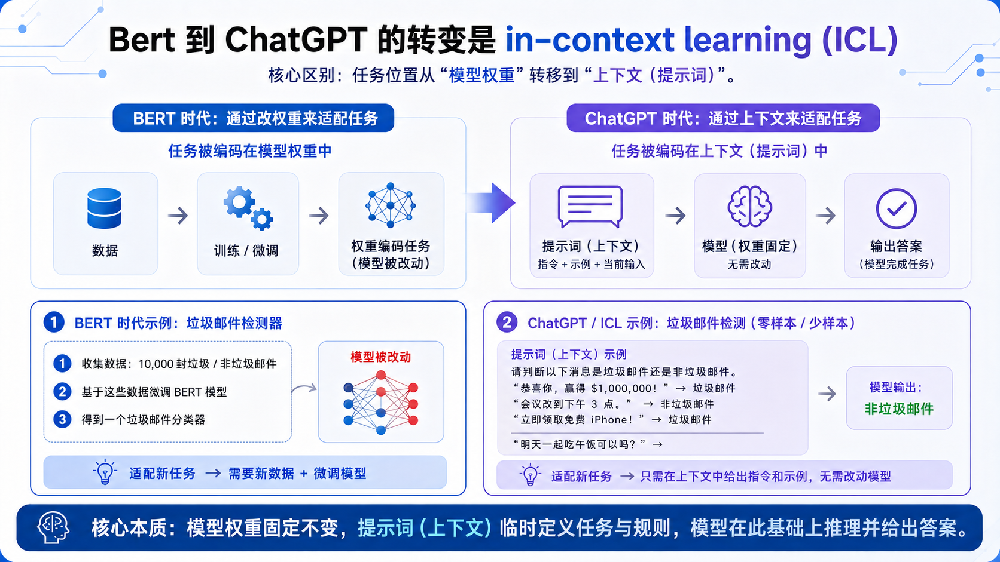

- **BERT 时代**：想让模型会一件新事，得拿这件事的数据去微调它。**任务被写进了权重里。** 换个任务，重来一遍。
- **ChatGPT 时代**：想让模型会一件新事，在提示词里给它两个例子就行，模型一个参数都不改。**任务被写进了上下文里。**

任务的位置从权重挪到了上下文。就这一挪，模型从"一个任务训一个模型"变成了"一个模型接无数任务"——所谓 ChatGPT 时刻，机制上就是这么来的。

**机器人现在刚走到同一个分水岭上。**

- **相当于 BERT 的那条路**，已经走了两年：拿一个开源基座（比如 π0.5），在自己场景的数据上微调一版。国内目前绝大多数团队在做的是这件事。任务仍然写在权重里。
- **相当于 ChatGPT 的那条路，刚刚才有人走通**：给模型看一段人做这件事的录像，它当场照着做，参数一个都不动。**那段录像就是提示词。** 就是 Generalist Robotics 和 Skild AI 这两家，这件事叫 **physical prompting**。

**这不是一场势均力敌的分岔——一条路上挤满了人，另一条上目前只有两家。** 这篇讲的就是那两家做对了什么。

而两条路的差别，不是效果好一点差一点，**是量级上的差别**——一个是"回去训一版"，一个是"现场演示一遍"。

（微调本身没有错，BERT 当年也很能打。问题在于它的天花板是固定的：每多一个任务，就得多训一版。）


## 一、先看一个画面

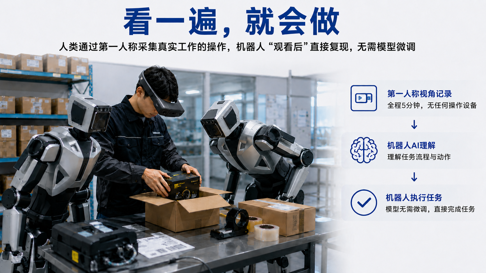

一个工人戴着一副采集设备，站在真实的工作台前，把一件商品装进箱子、封好、贴上标签。全程五分钟。他没有操作任何设备，就是正常干活。

旁边的机器人看完这五分钟的录像，直接开始做同样的事，并且做对了。

这里最反直觉的一点是：**机器人的模型，一个参数都没有改动。** 那五分钟的录像不是"训练数据"，它是被直接塞进模型输入里的——就像你给 ChatGPT 一个例子，它照着办。

这不是设想。就在刚刚，Generalist 和 Skild AI 两家实验室展示了最新的成果。

## 二、过去两年在补的课：数据

过去两年，机器人学技能主要靠两种数据。

### 第一条路：遥操作

人拿着手柄或穿戴设备，远程操纵机器人做一遍任务，全程录下来，机器人照着学。

它有一个唯一且不可替代的好处：**录下来的是机器人自己的关节数据**，可以直接拿去训练动作。

但代价很重。遥操作要有真机、要有操作员，一小时只产出一小时数据；操作员隔着延迟和界面干活，动作慢而别扭；更要命的是，真机搬不进真实场景，绝大多数遥操数据是在"数采厂"里采的——布置好的工位、固定的那几十种物体。**采到的是一个搭出来的世界。**

### 第二条路：第一人称操作数据

人戴一副带摄像头的设备，在真实环境里正常干活，全程第一视角录下来（ego-centric）。

行业今年已经普遍意识到这条路的价值，理由很直接：

- **采集效率高。** 人自己的手比遥操作方便太多——不需要真机，不需要培训操作员，一个人正常干活就是在采数据。
- **是实景。** 不用把场景搬进数采厂，直接在门店、仓库、厨房里采。
- **泛化性好。** 因为真实——真实的光照、真实的杂物、真实的意外。

### 这门课补对了，而且 ICL 之后更对

**in-context learning 出来之后，这批数据不但没贬值，反而多了一个用途。**

训练的时候，它是预训练语料。到了部署现场，**塞进模型上下文的那段演示，本身就是一段第一人称的人类操作视频**——第三节那个给植物上盆的例子，21:22 录完的就是这个。

**同一种数据，训练和部署两个位置都用得上。** 这两年往第一人称操作数据上押的功课，没有白补。

### 但数据补不上另一件事：怎么告诉它"现在要干哪件事"

数据决定的是**模型见过多少种东西**。它决定不了另一件事：**到了现场，你怎么把"现在要干这一件事"告诉它。**

这件事听起来像细节，其实是过去两年真正卡住的地方。因为老办法只有两个入口：

- **入口一：写进权重(finetuning)。** 采这个任务的数据、训一版模型。任务就锁在权重里了，换一个任务，重来一遍。**这就是第零节说的 BERT 做法。**
- **入口二：给一句话(language prompt)。** "把方块扫进碗里。" 这条便宜，但**一句话说不清楚物理动作**——怎么捏、用多大力、先动哪只手、卡住了怎么办。语言天生表达不了这些。

**一个太贵，一个太窄。** 而且这两个入口的宽度**和数据量无关**——再堆十倍数据，第一个入口还是一个任务一版，第二个入口还是那一句话。

**所以真正的问题不是"该采哪种数据"，而是：有没有第三个入口？**

## 三、今年的转向：in-context learning

Generalist Robotics 的 GEN-1.5 和 Skild AI 的 S1 刚刚给出的答案，方向高度一致：**in-context learning**。

### 两家分别做了什么

**Generalist GEN-1.5**（2026 年 8 月）的博客标题本身就是结论：*Embodied Foundation Models are One-Shot Learners*。塞进上下文的那个东西，他们叫 **physical prompt**——一段"看到的画面 + 做出的动作"的示例。**3 到 12 秒的一次演示，不做任何参数更新，模型在没训过的任务上平均成功率 59%。** 演示可以是人直接用自己的手在机器人的摄像头前做一遍，做完机器人立刻复现。

**Skild S1** 说得更彻底：这个模型"从一开始就是按 in-context learner 造的"。**任务不用语言描述，只用一段视频演示来指定。** 他们报出来的最长案例是**十分钟量级、且训练数据里从未出现过**的任务——给植物上盆、做手冲咖啡、煎饼、装配套件。

（两家叫法不同：Generalist 叫 physical prompting，Skild 叫 in-context learning，说的是同一件事。本文统一用 **physical prompting**，大白话就叫**会现学现用**。）

Skild 有一句话把机制讲得最清楚：**预训练是外循环，教的不是"怎么做这件事"，而是"怎么从例子里学"；到了现场，那段演示驱动内循环，一个参数都不动。**

这就是开头图 1 的机器人版：**任务从权重里，挪到了上下文里。**

### 快到什么程度：一条真实的时间线

上面说的都是机制。真正让人有体感的，是 Skild 记的一次部署——给植物上盆，一个训练数据里没有的任务：

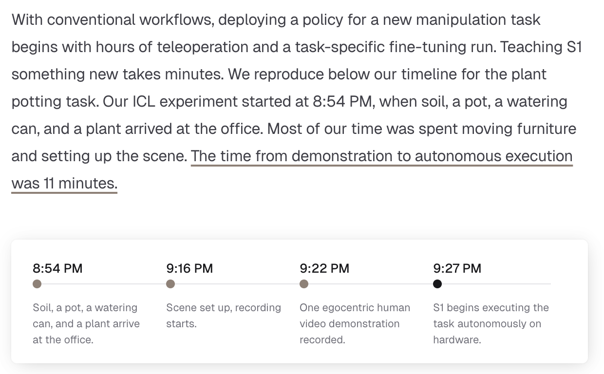

从材料送到办公室，到机器人自己开干，**总共 33 分钟**，其中大半时间还花在搬家具、布置场景上。Skild 自己强调的数字是：**从开始录演示到机器人自主执行，11 分钟。**

对照一下老流程：同一个新任务，先几个小时遥操作，再跑一次针对这个任务的微调，然后才谈得上部署。

**33 分钟和几天，不是同一件事的快慢，是两种做法。**

### 一条曲线，比任何演示视频都重要

Demo 视频是可以挑的，曲线不行。

Skild 做了一组很直白的对照，问的是一个能算账的问题：**在模型没见过的新任务上，上下文里的一段演示，抵得上多少次（用于微调的）示教？**

两条线放在同一张图上——

- **横平的那条**：in-context learning。它根本不训练，只是在上下文里拿到一段演示，所以是一条水平线，停在 **66%**。
- **爬升的那条**：老办法。语言指令 + 拿这个新任务的数据做微调（SFT），横轴是喂进去的示教次数，从 1 次一路加到一千多次。

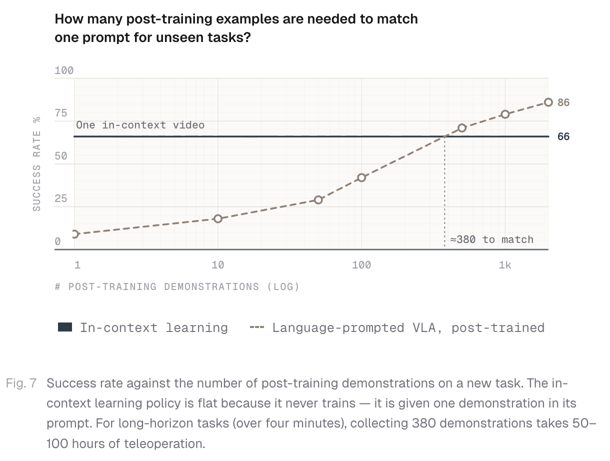

**微调那条线要爬到和"一段演示"齐平，大约需要 380 次示教。**

Skild 补了个换算，把这个数字变成体感：**对四分钟以上的长任务，采 380 次示教相当于 50 到 100 小时的遥操作。**

同一个新任务，两条路摆在面前：一边是让人对着机器人重复做三百多遍、再训一版；另一边是录一段演示塞进上下文，当场开干。


### 但这条曲线也说了另一半话

示教次数继续往上堆——一千次以上——微调能到 **86%**，反超 in-context 的 66%。

**老办法没有输，它只是变贵了。**

这一点必须说清楚，否则整篇就成了吹。真正变的不是天花板，是**起步价**：

- 过去让机器人会一件新事，起步价是几十小时遥操作，加一次训练。
- 现在起步价是一段演示。

这和 BERT 到 ChatGPT 那一步是同一件事。GPT-3 刚出来的时候，在很多具体任务上并不比精调过的 BERT 强；它改变的是，"让模型会一件新事"的门槛从**标一个数据集**降到了**写两个例子**。门槛一塌，能做的事情的种类就爆炸了——不是因为每件事做得更好，而是因为值得一做的事情突然多了几个数量级。

判断一次"阶跃"是真是假，看的就是这个：**门槛塌没塌。**

## 四、模型到底读懂了什么

第三节说的是"这件事是真的"——时间线在，曲线在，数字在。

但还有一个更要紧的问题没答：**模型从那段演示里，到底读到了什么？** 是把画面记下来照着重演一遍，还是真的看懂了"这件事要达成什么"。

这两者在顺利的时候看不出区别。**只有在演示本身不完美、或者演示和现场对不上的时候，才分得出来。**

### 演示本身是错的，它反而做对了

Skild 记了一个现象，比任何成功率都更能说明模型在干什么：**塞进上下文的那段演示，有时候本身就是错的。**

有一段演示里，示范的人手滑，鸡蛋提前掉了下去，摊了一桌子。S1 做到同一步的时候，做出来的是一个受控的放置动作。

Skild 的原话是：模型把演示当成的是**"目标的说明"，而不是"要照抄的轨迹"**（*a specification of the goal, not a trajectory to reproduce*）。

同一类现象还有：S1 失败的时候，倾向于**再试一次**，而不是闷头往下走。

这两件事听着像小事，其实压着一条很深的分界线。

### 照抄，还是算账

用两句大白话说清楚这条线：

- **照抄式的学法**：数据里那个人当时怎么做的，就是标准答案。模型的任务是把答案背得越像越好。演示里人把鸡蛋摔了，那"摔鸡蛋"就是标准答案。
- **算账式的学法**：数据里那个人当时怎么做的，只是**"在那个情况下，恰好有人这么做了"**——它不是标准答案。真正要问的是：**这么做下去，后面会变成什么样？** 好，就学；不好，就不学，甚至反着学。

差别的关键，在于**要不要往后看一步**。

照抄不往后看，它只关心"这一帧该输出什么动作"。算账必须往后看，它要问"做完这个动作，眼前会变成什么样，那个样子好不好"。

**摔在桌上的鸡蛋，是往后看一步就能看出来的坏。**

> **给技术读者：** 这就是 supervised behavior cloning 和 offline RL 的分界线。
>
> BC 把数据集里的动作当作 ground truth 标签，学的是 $\pi(s) \approx a_{\text{dataset}}$。
>
> Offline RL 不把记录下来的动作当真值——它只是"在状态 $s$ 下恰好被执行过的一个动作"，最优动作完全可能是另一个。它要的是 $\pi(s) = \arg\max_a Q(s,a)$，其中 $Q(s,a) = r(s,a) + \gamma\\,\mathbb{E}[V(s^{\prime})]$。
>
> **关键在那个 $s^{\prime}$：offline RL 会对"动作之后发生了什么"做推理，BC 通常不会。**
>
> 需要说明的是，Skild 并没有公布 S1 用的训练目标。这里讲的是**行为层面的分界线**，不是对它训练算法的断言。

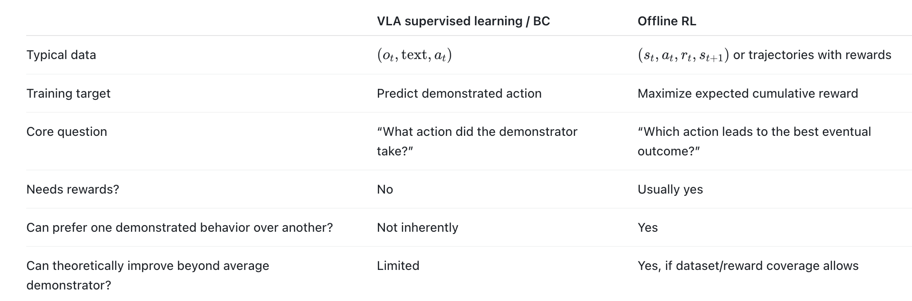


### 演示没错，但和现场对不上

演示本身有瑕疵，是一种情况。另一种情况更常见：**演示是好的，只是现场和录演示的时候不一样了。**

看它这时候干什么：

- 演示里用的是水壶，现场只剩一个杯子——S1 拿杯子浇。
- 演示里杯子是空的，现场那杯已经快满了——S1 只添了一点。
- GEN-1.5 那边，一个把方块扫进碗里的任务，模型在没有更好的工具的情况下，使用了香蕉作为工具。当碗的上放被盖了一张纸，模型会用另一只夹爪提起纸。 
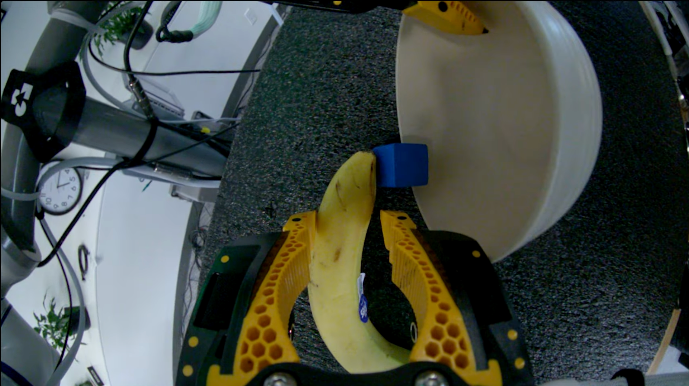
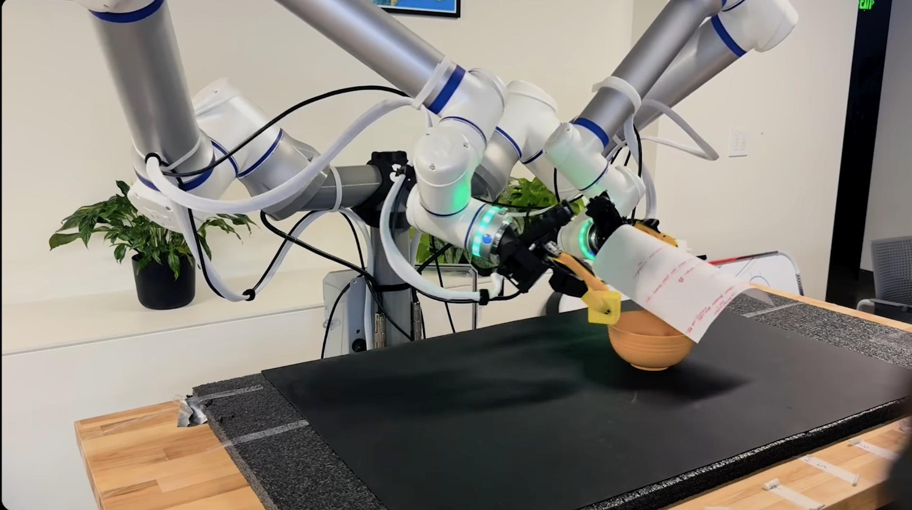

这些动作，演示里一个都没有。**纯靠模仿是做不出来的，因为模仿的对象里压根没有这个动作。** 它必须先读出演示想达成的目标，再判断手边这个不一样的东西能不能达成同一个目标。

**即兴发挥(improvisation)，是脑子存在的证据。**

### 即兴不是轶事，是可以量出来的

上面这些都是挑出来的例子，而例子永远可以挑。真正说明问题的是 Skild 做的另一件事：**他们把"泛化"拆成两把尺子，分开量。**

一旦模型是"看着上下文里的演示干活"，就必须同时看两个距离：

- **尺子一：现场离训练数据有多远。** 物体换了、位置挪了、摆得让机器人不得不换只手才够得着——这些偏离预训练分布的情况，模型扛不扛得住。
- **尺子二：现场离上下文里那段演示有多远。** 演示是在某一个场景里录的，真去干活的时候，桌上的东西不可能摆得一模一样。演示和现场对不上，模型还能不能用。

**第二把尺子是 physical prompting 特有的**——老办法里根本没有"演示"这个东西，也就无从谈起。

两把尺子都用 L1 到 L5 五档标刻度：L1 是一模一样，L5 是摆放位置刻意选成让机器人有一半动作必须换成另一只手来完成。

**尺子一：越难，差距拉得越开。**

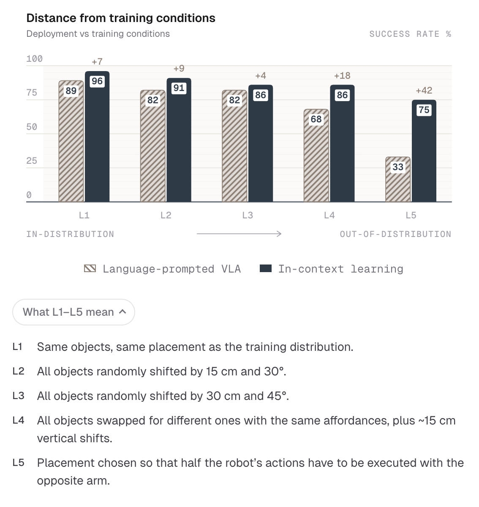

同一批任务，语言指令的模型和 in-context 的模型放在一起比：

- L1（和训练时一样）：89 vs 96，差 7 分。
- L5（最难）：33 vs 75，**差 42 分。**

**语言那条是断崖，in-context 那条是缓坡。**

这正好说明"即兴"是从哪儿来的：**上下文里那段演示一直在。** 现场再怎么变，模型手里始终攥着一份"这件事到底要达成什么"的说明书，所以它有依据去改。而语言指令那边，一句话在 L5 的摆放下能提供的信息，和 L1 时一样多——也就是一样少。

**尺子二：衰减是缓的，不是一脚踩空。**

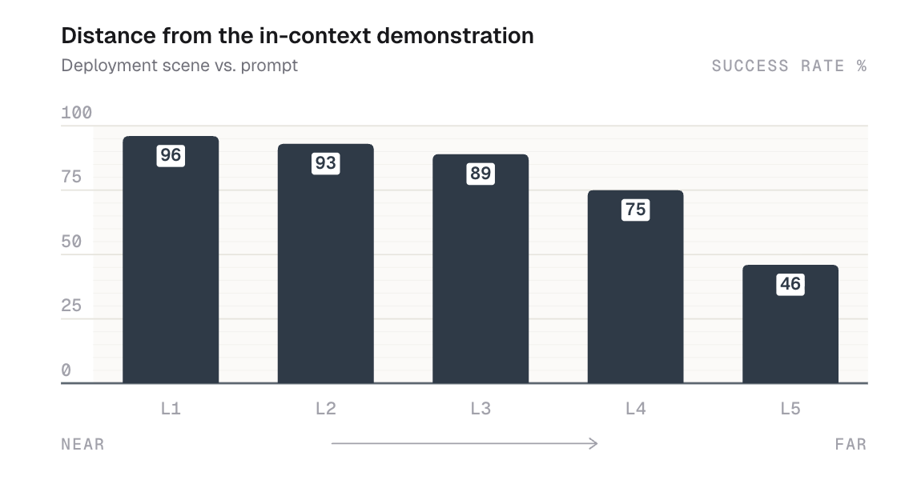

这一把量的是**演示和现场之间**的差距：L1 到 L3 几乎没掉（96 → 93 → 89），L4 掉到 75，L5 掉到 46。

关键不在绝对数字，在**这条线的形状是斜坡，不是悬崖**。

如果模型是在照抄演示里的轨迹，那么演示一旦对不上现场，它就该直接崩掉。它没崩，说明它把演示当成的是**目标的说明**——现场偏一点，它就跟着改一点。这和上面水壶换杯子、簸箕铲方块说的是同一件事，只不过这次有刻度。

落到实处，这一条决定了 physical prompting 在现场到底好不好用：**录演示的人不需要把场景摆得和演示一模一样。** 差不多就行——性能是平缓下降的。

开头那个画面（图 2）——工人干五分钟，机器人看完直接做对，参数一个都没改——就是这件事。

### 但也别急着把权重扔了

到这里为止，所有数字都是**一次演示、零参数更新**——这叫 one-shot。Skild 的 S1 整篇都停在这一档：它不训练，图 4 里那条线才是平的。

**但还有一档他们没做：few-shot——给几分钟数据，再动一点点权重。** Generalist 那边做了这个对照：

| | 数据量 | 参数更新 gradient steps | 新任务平均成功率 |
|---|---|---|---|
| **one-shot**（纯上下文） | 一段 12 秒的演示 | 0 步 | **59%** |
| **few-shot** | 5 分钟（约 10–50 次演示） | 10 步 | **83%** |

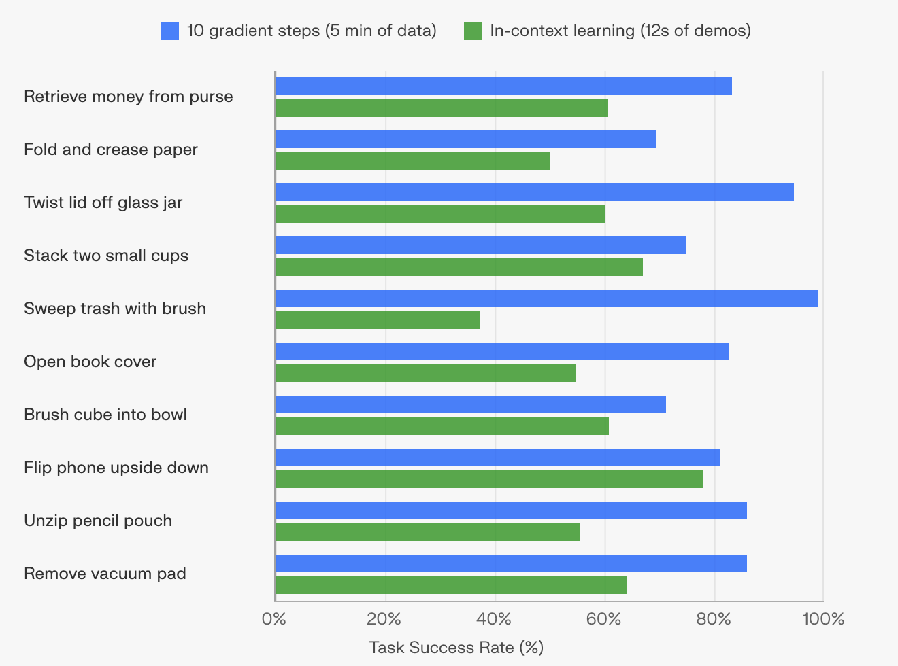

**59% 到 83%，24 个百分点，不是零头。** 而那十步动的权重不到 0.15%——几乎没改，但确实改了，改出来的差距还很大。

图 8 是这个对照的逐任务拆解，十个任务。表里那两个平均数，就是这十根柱子各自平均出来的。而拆开看，有两件事是平均数盖住的：

**第一，few-shot（蓝）在十个任务上全部赢过 one-shot（绿），一个例外都没有。**

**第二，差距的分布极不均匀。**

- 差得最少的是"把手机翻过来"：81% 对 78%，几乎打平。
- 差得最多的是"用刷子扫垃圾"：100% 对 37%，**差了六十多分。**
- 中间还有"拧开玻璃罐盖子"（95 对 60）、"拉开笔袋拉链"（87 对 55）。

把这十个任务排一排，能看出一点规律——**这是我从图上读出来的，Generalist 没有明说**：

**差距最大的那几个，都要持续用力或者维持接触**——扫、拧、拉拉链、压折痕。**差距最小的那几个，基本就是拿起来放下去、或者翻个面**——叠杯子、把方块扫进碗、翻手机。

也就是说：**一段演示能把"要干什么"说清楚，但说不清"要用多大力、拧多久、扯多稳"。** 这类信息，看一遍是拿不到的。

（顺带一提，few-shot 那边也不是全线飘红：折纸压痕 70%、把方块扫进碗 71%、叠两个小杯子 75%。十步更新也不解决所有问题。）

所以话要说老实：**现在远没到"可以完全不动权重"的时候。**

physical prompting 把起步价打下来了，但它目前的水平是**"能开工"，不是"能交付"**。从能开工到能交付，那几分钟数据和那十步更新，还是得付。

这一档的名字值得记住——**few-shot learner**。它大概率才是未来一两年真正落地的形态：**上下文负责"这是什么任务"，一点点权重更新负责"在这个现场能做到多好"。** 至于 one-shot 会不会一路把 few-shot 也吃掉，再看看。

### 别把功劳记错了：即兴是预训练喂出来的

读到这儿容易生出一个错觉——好像"把演示塞进上下文"这个机制本身，就带来了即兴能力。

不是的。

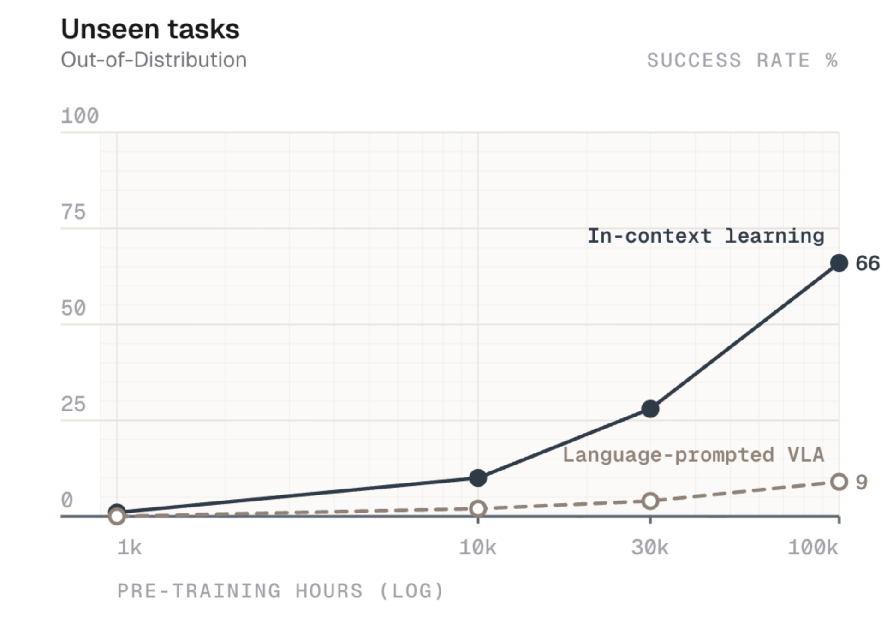

这张图的横轴是**预训练数据量**（1 千小时到 10 万小时，对数轴），纵轴是在**训练里没见过的任务**上的成功率。

先看 in-context 那条线：

- 1 千小时：**几乎是零。**
- 1 万小时：5 左右。
- 3 万小时：24。
- 10 万小时：**66。**

**同一个机制，同样给它一段演示，在 1 千小时那个点上什么也变不出来。** 即兴不是"上下文"这个通道变出来的，是**预训练喂出来的**——上下文只是那个把它调出来的开关。

再看语言指令那条线：从头到尾贴着地板，堆到 10 万小时也才 9。

两条线合起来说的是一件事：**数据要够多，而且得有一个能把数据变成即兴能力的架构。缺哪一样都不行。** 同样的数据吃下去，两种架构长出来的东西完全不是一回事。

**这又是 ChatGPT 那个故事。** GPT-3 的 in-context learning 不是谁设计出来的功能，是数据和参数堆到某个规模之后自己冒出来的。BERT 时代那些模型不是不会读提示词，是规模不到，读了也没用。

所以最后落回一个很朴素的地方：**这一切的前提，是又多又杂的预训练数据。** Skild 自己的说法是——遥操作、UMI、第一人称视频、仿真，没有哪一路能在可扩展性、多样性、和硬件的贴近程度上同时占优，所以四路全都在扩。

**"杂"不是妥协，是即兴能力的来源。**

## 五、所以，变的是什么

回到第二节那个问题：老办法只有两个入口——**写进权重**，太贵；**给一句话**，太窄。

physical prompting 开了第三个：**做一遍给它看。**

这个入口有多宽，前面那些数字已经说了——一段几秒到几分钟的演示，抵得上三百多次示教；从材料到货到机器人开工，33 分钟；现场和演示对不上，性能是缓坡不是悬崖。

但真正变的不是某一个成功率，是**谁能把任务交给机器人**。

过去机器人在新场景里不会做某件事，唯一的解法是把问题带回实验室：采数据、训模型、再来部署。现在解法在现场，而且执行的人不需要懂机器人——**他只需要会做这件事本身。**

**教机器人的门槛，从"会训模型"降到了"会干这个活"。**

话也得说回来。这个入口现在还不够宽：一次演示到得了"能开工"，要"能交付"，那五分钟数据和十步更新还是得付。而且这一切的前提，是预训练已经堆到了十万小时那个量级——**入口是这几年数据堆出来的，不是谁设计出来的。**

但方向已经清楚了。语言模型那边，从"一个任务训一版"走到"写两个例子就行"，也没用多久。机器人这边，这一步刚刚迈出去。

## 六、附：这套东西大概会怎么搭

前面讲的都是"它能干什么"。这一节是给想知道"它是怎么搭出来的"那部分读者的，**不看不影响前面的结论。**

**先说清楚：Skild 和 Generalist 都没有公开各自的网络结构。** 下面这张图是根据两家博客里的公开描述、加上过去几年相关工作推演出来的一种实现方式——**是一份设计草案，不是对任何一家的还原。**

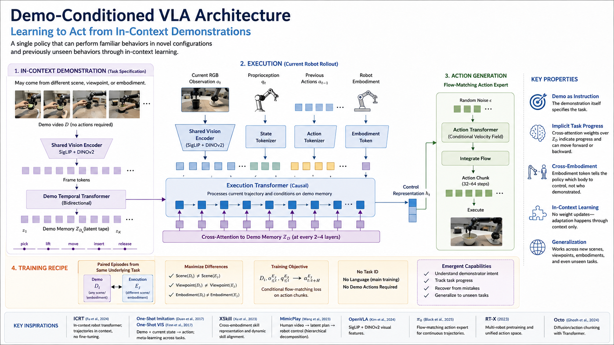

### 设计上的几个核心想法

**① 演示本身就是指令——演示侧不需要语言，也不需要动作标注。**

图左边那块，输入是一段演示视频 `D`。两个"不需要"很关键：**不需要配文字任务描述，也不要求演示带动作数据。** 视频过共享视觉编码器（SigLIP + DINOv2）拿到帧 token，再过一层双向时序 Transformer，编码成一条 **Demo Memory `Z_D`**——一条 latent tape，把"这件事分几步、每一步大概应该是什么状态"记在里面。

不需要动作标注这一条，直接决定了**演示可以由人来录**：人手的关节数据本来也对不上机器人。

**② 演示侧双向，执行侧因果。**

中间那块是执行主干（Execution Transformer，causal），吃当前画面 `o_t`、本体感知 `q_t`、之前的动作，外加一个本体 token。它每隔 2–4 层，向 Demo Memory 做一次 **cross-attention**。

这个不对称是有道理的：**演示是已经完整发生过的事，可以整段来回看；执行是正在发生的事，只能基于已经发生的历史往前走。**

**③ "做到哪一步了"不是一个状态机，而是与演示的动态对齐。**

执行侧一直在对 `Z_D` 做 cross-attention。**注意力主要落在演示的哪一段，可以理解成模型认为当前最相关的任务阶段。**

而且这种对齐可以往回走——如果中间搞砸了，当前状态又重新对应到前面的阶段，模型可以重新关注更早的 latent token。**"重试"不一定需要单独写一个纠错模块，而可以从这种动态对齐里自然出现。**

第四节说的"演示错了它反而做对了"，在这个结构里也有一定解释空间：模型学的不是逐帧复制动作轨迹，而是从 `Z_D` 中提取任务结构和目标状态。因此它原则上可以忽略一些与任务无关的动作细节，而不是原样照抄。

**④ 本体 token 管"我是谁"，演示管"要干什么"。**

Embodiment Token 告诉策略要控制哪一具身体，而不是谁做的演示。**这是同一个模型能换着身体用的关键**——演示可以是人手录的，也可以是另一款机器人录的；真正执行动作的，永远是当前这台机器人。

**⑤ 动作用 flow matching 生成，一次出一整段。**

右边那块不是逐帧回归动作，而是从随机噪声出发，用条件速度场积分出一整段 **32–64 步的 action chunk** 再执行。这是 π₀ 那一系的路线，好处是更适合建模连续、多模态的动作轨迹，也适合高频控制。

### 训练配方比结构更关键

图里第 4 块是我觉得最值得看的地方：**怎么造训练数据，决定了模型会不会真的去学 in-context，还是偷懒。**

做法是——同一个任务，配一对 episode：**演示 `D_i` 和执行 `E_j` 来自不同的场景、不同的视角、不同的本体，而且这个差异是刻意拉大的。**

为什么必须这样？因为如果演示和执行长得太像，模型完全可以退化成"照着画面抄"，根本用不着去理解演示的意图。**把两者拉开，模型才被逼着去学"这段演示到底想达成什么"。**

配套还有几个"不给"：**不给任务 ID；主训练阶段可以不给语言；不要求演示带动作标注。** 每一条都在堵捷径——**让演示本身成为最可靠的任务信息来源。**

这也正好对应 Skild 那句"预训练是外循环，教的不是怎么做这件事，而是怎么从例子里学"：**外循环学的是"如何读懂 demonstration"；推理时则通过上下文完成 inner loop，不更新权重。**

图里列的"涌现能力"——读懂演示者的意图、跟踪任务进度、从错误里恢复、泛化到没见过的任务——**都不一定需要单独做成模块，而希望是这套训练配方下自然出现的能力。**

### 参考的工作

这张图不是凭空来的，来路是这些：

- **ICRT**（Fu et al., 2024）—— in-context robot transformer：把轨迹放进上下文、不微调。最直接的前身。
- **One-Shot Imitation Learning**（Duan et al., 2017）、**One-Shot Visual Imitation**（Finn et al., 2017）—— "演示 + 当前状态 → 动作"，跨任务元学习。
- **XSkill**（Xu et al., 2023）—— 跨本体的技能表示与动态对齐。
- **MimicPlay**（Wang et al., 2023）—— 人类视频 → latent plan → 机器人控制的层次分解。
- **OpenVLA**（Kim et al., 2024）—— SigLIP + DINOv2 的视觉特征组合。
- **π₀**（Black et al., 2025）—— 面向连续轨迹的 flow-matching action expert。
- **RT-X**（2023）—— 多机器人预训练与统一动作空间。
- **Octo**（Ghosh et al., 2024）—— 基于 Transformer 的 diffusion / action chunking。

值得注意的是：**One-Shot Imitation Learning 是 2017 年的工作。** 这条路线本身一点都不新——新的是第四节最后那张图（图 9）说的那件事：**规模到了，它才开始有用。**

---

本篇讲的是**部署现场**发生的事：演示进上下文，模型当场照做。

下篇换一个位置看同一批数据——**训练阶段**。Physical Intelligence 的思路是把"看到画面"到"手动起来"之间的黑箱拆开，插进几层人能看懂的中间能力：会拆解、会想象、会判断。下篇会说这三样分别是什么、为什么同样一批第一人称操作数据教这三样比遥操作数据教得更好，以及从"一堆录像"到"可训练的原料"之间，那道一直被低估的精标工序。
